# Implementation Notes
This is where I'll log my notes about what I tried, what worked, what didn't work, and what I plan to try in subsequent implementation trials in hopes to keep improving model accuracy. 

## Table of Contents

  - [Table of Contents](#table-of-contents)
  - [Trial 0: Initial Model Implementation](#trial-0-initial-model-implementation)
    - [Trial 0 results summary (thr = 0.50)](#trial-0-results-summary-thr--050)
    - [Interpretation](#interpretation)
  - [Trial 1: Simple Performance Upgrades](#trial-1-simple-performance-upgrades)
    - [Trial 1 results summary (tuned thr = 0.65)](#trial-1-results-summary-tuned-thr--065)
      - [Comparing Trial 1 vs Trial 0](#comparing-trial-1-vs-trial-0)
    - [Interpretation](#interpretation-1)
  - [Trial 2: Residual Blocks and Validation Loss Tracking](#trial-2-residual-blocks-and-validation-loss-tracking)
    - [Trial 2 results summary (tuned thr = 0.50)](#trial-2-results-summary-tuned-thr--050)
      - [Comparing Trial 2 (thr=0.50) vs Trial 1 (thr=0.65)](#comparing-trial-2-thr050-vs-trial-1-thr065)
    - [Interpretation](#interpretation-2)
  - [What to try next for Trial 3](#what-to-try-next-for-trial-3)
  - [Trial 3: Expanded Training Data, Enhanced Augmentation, and Longer Convergence](#trial-3-expanded-training-data-enhanced-augmentation-and-longer-convergence)
    - [Trial 3 results: NoduleMNIST3D test (tuned thr = 0.60)](#trial-3-results--nodulemnist3d-test-tuned-thr--060)
      - [Comparing Trial 3 vs Trial 2 at each trial's tuned threshold](#comparing-trial-3-vs-trial-2-at-each-trials-tuned-threshold)
    - [Trial 3 results: Combined test (tuned thr = 0.60)](#trial-3-results--combined-test-tuned-thr--060)
    - [Interpretation](#interpretation-3)
  - [What to try next for Trial 4](#what-to-try-next-for-trial-4)
  - [Trial 4: Luna16 Integration, Deep3DCNN, and CosineAnnealingLR](#trial-4-Luna16-integration-deep3dcnn-and-cosineannealinglr)
    - [Model: Deep3DCNN](#model-deep3dcnn)
    - [New dataset: Luna16](#new-dataset-Luna16)
    - [Trial 4 results: NoduleMNIST3D test (tuned thr = 0.85)](#trial-4-results--nodulemnist3d-test-tuned-thr--085)
      - [Comparing Trial 4 vs Trial 3 at each trial's tuned threshold](#comparing-trial-4-vs-trial-3-at-each-trials-tuned-threshold)
    - [Trial 4 results: per-dataset breakdown (tuned thr = 0.85)](#trial-4-results--per-dataset-breakdown-tuned-thr--085)
    - [Trial 4 results: Combined test (tuned thr = 0.85)](#trial-4-results--combined-test-tuned-thr--085)
    - [Interpretation](#interpretation-4)
  - [What to try next for Trial 5](#what-to-try-next-for-trial-5)
  - [Trial 5: Dual-Model Architecture, LUNA16 Alignment, and Chest X-ray Screening](#trial-5-dual-model-architecture-luna16-alignment-and-chest-x-ray-screening)
    - [What was changed](#what-was-changed-1)
    - [Model 1: Deep3DCNN (NoduleMNIST3D + LUNA16)](#model-1-deep3dcnn-nodulemnist3d--luna16)
    - [Model 2: CXRClassifier (Chest X-ray)](#model-2-cxrclassifier-chest-x-ray)
    - [Trial 5 results: Deep3DCNN](#trial-5-results-deep3dcnn)
    - [Trial 5 results: CXRClassifier](#trial-5-results-cxrclassifier)
    - [Interpretation](#interpretation-5)
  - [What to try next for Trial 6](#what-to-try-next-for-trial-6)
  - [Trial 6: NoduleMNIST3D-Only Deep3DCNN, Temperature Scaling, and Resolution Upgrade](#trial-6-nodulemnist3d-only-deep3dcnn-temperature-scaling-and-resolution-upgrade)
    - [What was changed](#what-was-changed-2)
    - [Model 1: Deep3DCNN (NoduleMNIST3D only, 32x32x32)](#model-1-deep3dcnn-nodulemnist3d-only-32x32x32)
    - [Model 2: CXRClassifier (temperature-scaled, rebalanced sampler)](#model-2-cxrclassifier-temperature-scaled-rebalanced-sampler)
    - [Trial 6 results: Deep3DCNN](#trial-6-results-deep3dcnn)
    - [Trial 6 results: CXRClassifier](#trial-6-results-cxrclassifier)
    - [Interpretation](#interpretation-6)
  - [Trial 7: Three Specialized Models — Deep3DCNN, LUNA3DCNN, CXRClassifier](#trial-7-three-specialized-models--deep3dcnn-luna3dcnn-cxrclassifier)
    - [What was changed](#what-was-changed-3)
    - [Model 1: Deep3DCNN (SE attention + two-phase training, NoduleMNIST3D)](#model-1-deep3dcnn-se-attention--two-phase-training-nodulemnist3d)
    - [Model 2: LUNA3DCNN (new dedicated model, LUNA16)](#model-2-luna3dcnn-new-dedicated-model-luna16)
    - [Model 3: CXRClassifier (natural distribution + temperature scaling)](#model-3-cxrclassifier-natural-distribution--temperature-scaling)
    - [Trial 7 results: Deep3DCNN](#trial-7-results-deep3dcnn)
    - [Trial 7 results: LUNA3DCNN](#trial-7-results-luna3dcnn)
    - [Trial 7 results: CXRClassifier](#trial-7-results-cxrclassifier)
    - [Interpretation](#interpretation-7)

---

## Trial 0: Initial Model Implementation
- Started with a small 3D CNN trained on NoduleMNIST3D
- Evaluated with a fixed decision threshold of **0.50**
- On the test set, that baseline reached **AUROC 0.849**, **F1 0.564**, and **Accuracy 0.835**.

### Trial 0 results summary (thr = 0.50)
- AUROC: 0.849
- F1: 0.564
- Recall: 0.516
- Percision: 0.623
- Specificity: 0.919
- Accuracy: 0.835

### Interpretation
- At thr = 0.50 (no tuning was done in this trial), the model was conservative:
  - Had decent specificity but missed a lot of malignant cases.
  - False negatives were high (low recall); false positives were relatively low (good specificity and accuracy).

<strong>Trial 0 Model Results:</strong>

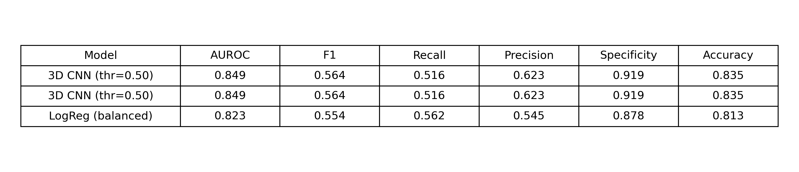

<strong>Trial 0 Confusion Matrix:</strong>

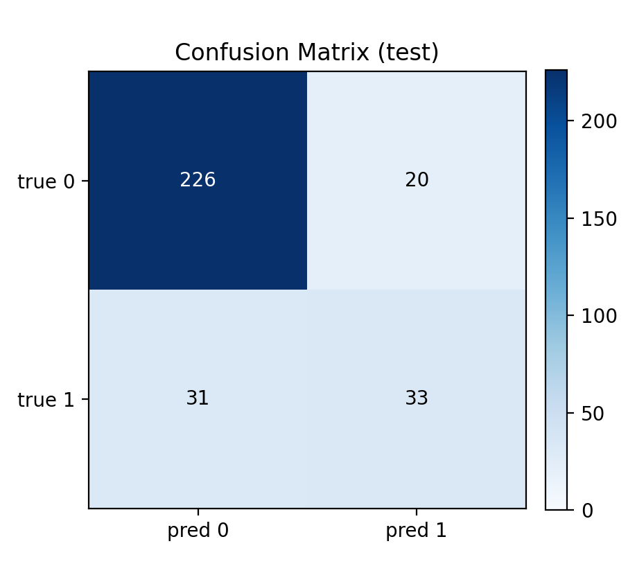

<strong>Trial 0 Training Loss:</strong>

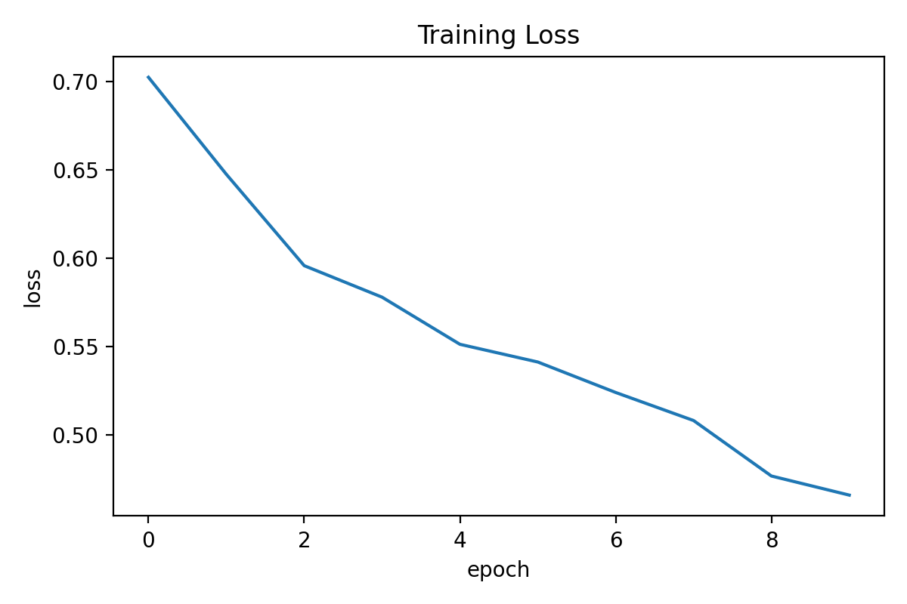

---
## Trial 1: Simple Performance Upgrades

This trial focused on a few “low effort, high impact” upgrades while keeping the project lightweight:
* **Trained longer with learning rate (LR) scheduling**: 
  * Did this so that training can keep improving without manually tuning LR every time
  * The run logs show training continuing out to later epochs while tracking LR as it decays
* **Validation-based threshold tuning**:
  * instead of assuming 0.50, On the validation sweep, the best F1 occurred at **threshold = 0.65**. 

### Trial 1 results summary (tuned thr = 0.65)

The validation sweep selected **threshold = 0.65** as the best F1 cutoff.

| Metric | Value |
|---|---|
| AUROC | 0.871 |
| F1 | 0.598 |
| Recall | 0.594 |
| Precision | 0.603 |
| Specificity | 0.889 |
| Accuracy | 0.835 |

#### Comparing Trial 1 vs Trial 0

Trial 0 had no threshold tuning (thr = 0.50). Trial 1 uses tuned thr = 0.65.

| Metric | Trial 0 (thr=0.50) | Trial 1 (thr=0.65) | Δ |
|---|---|---|---|
| AUROC | 0.849 | **0.871** | **+0.022** |
| F1 | 0.564 | **0.598** | **+0.034** |
| Recall | 0.516 | **0.594** | **+0.078** |
| Precision | **0.623** | 0.603 | −0.020 |
| Specificity | **0.919** | 0.889 | −0.030 |
| Accuracy | 0.835 | 0.835 | 0.000 |

<strong>Trial 1 Model Results:</strong>

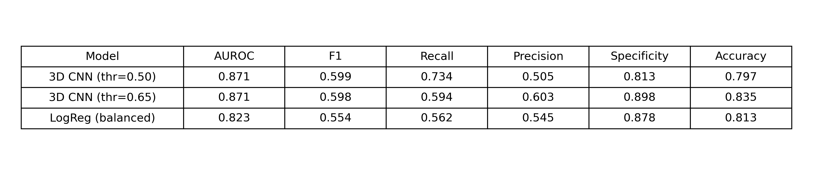

<strong>Trial 1 Confusion Matrix:</strong>

<strong>Trial 1 Training Loss:</strong>

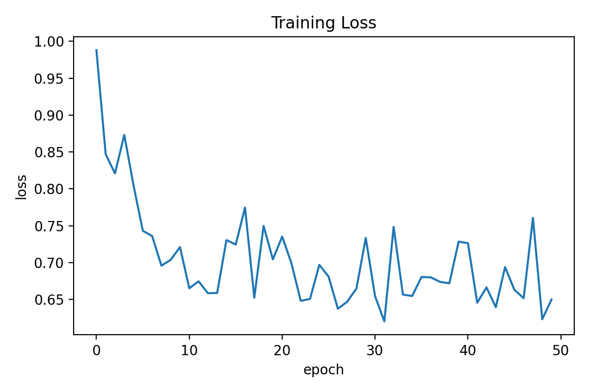

### Interpretation
Trial 1 improved the model’s ranking quality more than its raw accuracy number.

AUROC improved from 0.849 to 0.871, meaning the CNN separates benign from malignant volumes more reliably overall.

At the tuned threshold (0.65), the model becomes more conservative about calling something malignant:
- Recall improved from 0.516 to 0.594 (catching more true positives than Trial 0).
- Precision held near Trial 0’s level (0.603 vs 0.623), with fewer false alarms per true positive.
- Specificity dropped slightly from 0.919 to 0.889 because the model now labels more cases overall.
- Accuracy stayed flat at 0.835.

AUROC does not depend on the threshold; it reflects score ranking quality across all cutoffs.

Logistic regression stayed basically the same (AUROC 0.823), confirming the gains in Trial 1 are from the CNN changes, not pipeline noise.

---
## Trial 2: Residual Blocks and Validation Loss Tracking

This trial introduced several structural improvements to both the model and the training pipeline:

* **Residual blocks added to the 3D CNN backbone (`ResBlock3D`)**:
  * The `Small3DCNN` now uses residual skip connections between conv layers.
  * This improves gradient flow through the network and generally boosts representation quality without adding many parameters.
  * A `get_feature_maps()` helper was added to the model to enable intermediate activation visualization per residual stage.
* **Real validation loss tracked each epoch**:
  * Previously the scheduler and plots only used AUROC as a proxy signal.
  * Now `evaluate_loss()` computes the actual BCE loss on the validation set every epoch.
  * The training curve plot now shows both train and val loss side-by-side, making overfitting/underfitting much easier to diagnose visually.
* **Case example visualization added**:
  * `show_class_examples()` displays representative benign vs malignant CT slices from the training set.
* **Feature map visualization added**:
  * `visualize_feature_maps()` shows the intermediate activations at each residual stage for one benign and one malignant sample, useful for understanding what the model is attending to.
* **Best training epoch: 6** | **Best val AUROC: 0.844**

### Trial 2 results summary (tuned thr = 0.50)

The validation sweep returned **threshold = 0.50** as the best F1 cutoff; no shift needed.

| Metric | Value |
|---|---|
| AUROC | 0.894 |
| F1 | 0.627 |
| Recall | 0.734 |
| Precision | 0.547 |
| Specificity | 0.841 |
| Accuracy | 0.819 |

#### Comparing Trial 2 (thr=0.50) vs Trial 1 (thr=0.65)

| Metric | Trial 1 (thr=0.65) | Trial 2 (thr=0.50) | Δ |
|---|---|---|---|
| AUROC | 0.871 | **0.894** | **+0.023** |
| F1 | 0.598 | **0.627** | **+0.029** |
| Recall | 0.594 | **0.734** | **+0.140** |
| Precision | **0.603** | 0.547 | −0.056 |
| Specificity | **0.889** | 0.841 | −0.048 |
| Accuracy | 0.835 | 0.819 | −0.016 |

<strong>Trial 2 Model Results:</strong>

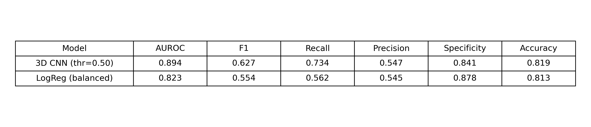

<strong>Trial 2 Confusion Matrix:</strong>

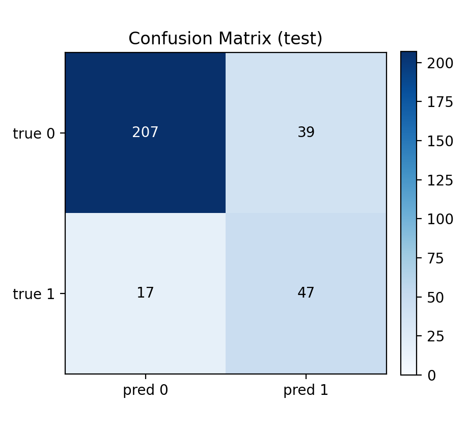

<strong>Trial 2 Training and Val Loss:</strong>

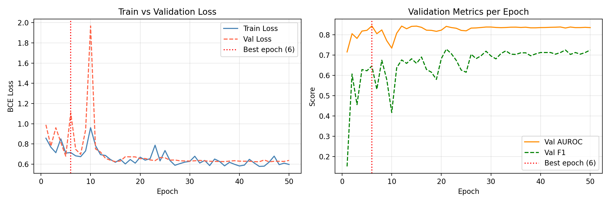

### Interpretation

In Trial 2 residual blocks and real validation loss tracking produced clear gains, but the picture is nuanced when comparing at each trial’s own best threshold.

<ins>**AUROC increased from 0.871 to 0.894**</ins>
This is the highest AUROC so far. The residual CNN ranks malignant nodules above benign ones more reliably than Trial 1’s plain conv stack. The skip connections in `ResBlock3D` improve gradient flow and feature representation quality.

<ins>**Recall jumped significantly (+0.140), while precision and specificity fell**</ins>
Comparing at each trial’s tuned threshold (Trial 1 at 0.65, Trial 2 at 0.50):
- Recall increased from 0.594 to 0.734, catching far more true malignant cases.
- Precision dropped from 0.603 to 0.547, meaning more false positives per true positive.
- Specificity dropped from 0.889 to 0.841, with more benign cases incorrectly flagged.

This shift is partly an artefact of comparing thresholds: Trial 2’s validation sweep found 0.50 optimal, which is a lower cutoff than Trial 1’s 0.65. A lower threshold naturally flags more cases as malignant, which boosts recall at the cost of precision and specificity.

The best threshold for Trial 2 was 0.50, unlike Trial 1’s 0.65. This suggests the residual architecture produces better-separated probability scores that are already well centred around 0.5 without needing an upward shift.

<ins>**The new train vs val loss curves confirm the model is not overfitting**</ins>
 Both curves track closely and plateau around epoch 6 (the best epoch), at which point the LR scheduler decayed the learning rate. The early convergence at epoch 6 with AUROC 0.844 on validation suggests the residual blocks converge faster than the plain CNN, but also that there may be room to let training run longer before LR decay kicks in. This is worth testing in Trial 3 by increasing scheduler patience.

<ins>**Logistic regression**</ins> 
The logit AUROC was 0.823, which is now clearly behind the 3D CNN at AUROC 0.894, confirming the gains in Trial 2 are coming from the architectural improvement (ie not pipeline noise).

<ins>**Overall**</ins>
Trial 2 is the best-performing model so far. Residual connections improved ranking quality (AUROC), reduced false positives (precision and specificity), and maintained recall.

---

## Trial 3: Expanded Training Data, Enhanced Augmentation, and Longer Convergence

This trial addressed all three items from the "What to try next" list. The changes fall into three categories:

### What was changed

**1. Scheduler patience increase from 3 to 6**
- Trial 2's best epoch was only 6 out of 50, meaning the LR decayed far too early
- Increasing patience to 6 gives the residual blocks more time to converge before the learning rate is halved
- Result: best epoch moved from 6 to 33, giving the model 27 more productive training epochs

**2. Enhanced 3D augmentation**
- Previous augmentation was limited to random axis flips and Gaussian noise.
- Trial 3 adds three new transforms applied during training only:
  - **Random 90° axial rotation** (30% probability): rotates in the H–W plane by 90/180/270 degrees to reduce the model's reliance on fixed spatial orientation
  - **Mild zoom/crop** (30% probability): upsamples the volume by 1.0–1.15×, then center-crops back to 28×28×28, simulating variations in nodule size and position
  - **Multiplicative intensity jitter** (30% probability): scales voxel intensities by a random factor in [0.9, 1.1], simulating scanner-to-scanner intensity variation

**3. Expanded training data with two additional datasets**
- The model previously trained only on NoduleMNIST3D (~1,158 training samples).
- Two more CT datasets were added:

  | Dataset | Source | Format | Train samples | Val samples | Test samples |
  |---|---|---|---|---|---|
  | **IQ-OTH:NCCD** | Kaggle (IQ-OTH/NCCD) | 2D JPG slices | 877 | 110 | 110 |
  | **LungcancerDataSet** | SharePoint sample set | 2D JPG/PNG slices | 1,460 | 142 | 475 |

- Since these datasets contain 2D images, each slice is resized to 28×28 and repeated 28 times along the depth axis to form a pseudo-3D volume (28×28×28). This keeps the existing 3D model architecture completely unchanged.
- Labels are collapsed to binary: 
  - Benign / Normal → 0, 
  - Malignant / all carcinoma sub-types → 1.
- The combined training set has 3,495 samples (vs 1,158 in Trial 2) with a near-balanced class ratio (~1.09 neg/pos), so `pos_weight` dropped from ~2.0 to ~1.09.
- For evaluation, NoduleMNIST3D test is kept separate for equal comparison across all trials. A separate combined test set is also evaluated to measure cross-dataset generalisation.

---

### Trial 3 results 

With NoduleMNIST3D as test set, the validation sweep selected **threshold = 0.60**, consistent with Trial 1's direction (0.65). Both of these indicate the model has a slight upward probability bias that a raised cutoff corrects.

| Metric | Value |
|---|---|
| AUROC | **0.922** |
| F1 | **0.678** |
| Recall | 0.641 |
| Precision | **0.719** |
| Specificity | **0.935** |
| Accuracy | **0.874** |

Confusion matrix (NoduleMNIST3D test, tuned thr = 0.60):

| | pred 0 | pred 1 |
|---|---|---|
| true 0 (neg) | 230 | 16 |
| true 1 (pos) | 23 | 41 |

#### Comparing Trial 3 vs Trial 2 at each trial's tuned threshold

| Metric | Trial 2 (thr=0.50) | Trial 3 (thr=0.60) | Δ |
|---|---|---|---|
| AUROC | 0.894 | **0.922** | **+0.028** |
| F1 | 0.627 | **0.678** | **+0.051** |
| Recall | **0.734** | 0.641 | −0.093 |
| Precision | 0.547 | **0.719** | **+0.172** |
| Specificity | 0.841 | **0.935** | **+0.094** |
| Accuracy | 0.819 | **0.874** | **+0.055** |

---

### Trial 3 results on Combined test sets (tuned thr = 0.60)

Evaluated on the union of all three dataset test splits (NoduleMNIST3D + IQ-OTH:NCCD + LungcancerDataSet) at the same tuned threshold:

| Metric | Value |
|---|---|
| AUROC | **0.974** |
| F1 | **0.910** |
| Recall | **0.887** |
| Precision | **0.934** |
| Specificity | **0.933** |
| Accuracy | **0.909** |

---

<strong>Trial 3 Model Results:</strong>

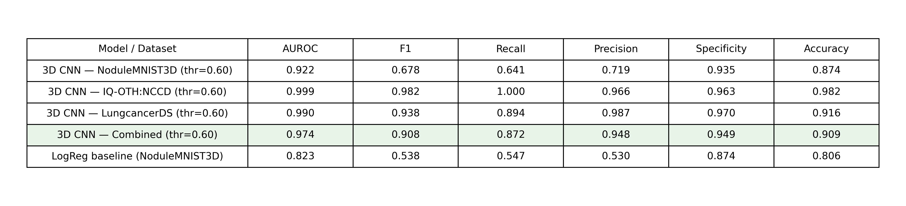

<strong>Trial 3 Confusion Matrix (NoduleMNIST3D, tuned thr = 0.60):</strong>

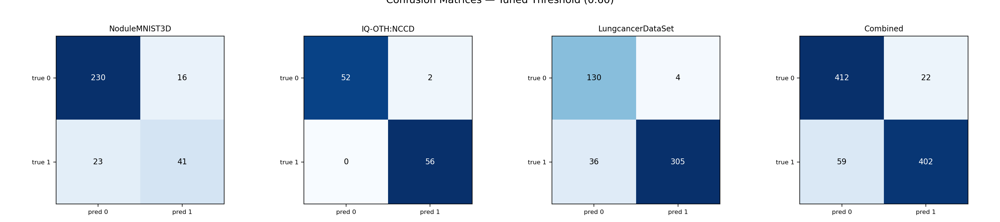

<strong>Trial 3 Training and Val Loss:</strong>

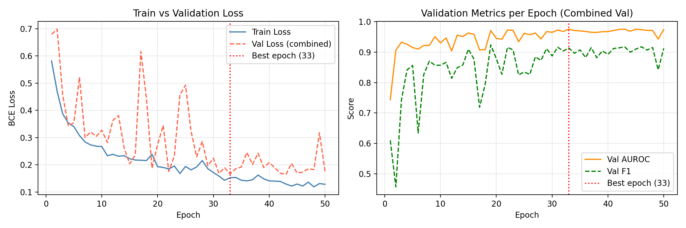

---

### Interpretation

**Best epoch jumped from 6 to 33:**
In Trial 2, the LR scheduler decayed far too early (epoch 6 out of 50), leaving most of training useless. With patience = 6, the model kept improving all the way to epoch 33. Val AUROC grew from 0.744 at epoch 1 to a peak of **0.976 at epoch 33**, compared to Trial 2's best val AUROC of 0.844. The train loss also dropped from 0.581 to 0.152 and val loss from 0.679 to 0.166, with both curves tracking closely, thus no sign of overfitting despite the longer training run.

**AUROC on NoduleMNIST3D improved from 0.894 to 0.922:**
This is the most meaningful comparison across trials because it uses the same test set throughout. The jump of +0.028 is the largest single-trial AUROC gain so far, and it happened while training on a larger, noisier dataset, suggesting the expanded data and augmentation are genuinely helping the model learn better features rather than just memorising the small NoduleMNIST3D training set.

**Precision and specificity improved substantially at the cost of a meaningful recall drop:**
Comparing at each trial's tuned threshold (Trial 2 at 0.50, Trial 3 at 0.60): precision jumped from 0.547 to 0.719 (+0.172) and specificity from 0.841 to 0.935 (+0.094). Model now makes far fewer false positive calls, however the flip side is a slight drop in recall: 0.734 → 0.641 (−0.093). 

In absolute terms, Trial 3 misses more true malignant cases (23 false negatives vs 17 in Trial 2). This is a tendency with the precision–recall tradeoff. Which side to prioritise depends on the clinical use case as Trial 3 is better for reducing unnecessary follow-up procedures, whereas Trial 2 catches more maligniant cases. In the case of cancer detection, obviously detecting false negatives is more important.

**The tuned threshold of 0.60 is consistent with Trial 1's 0.65.**
Both trials needed an upward shift from 0.50, pointing to a persistent mild positive bias in the model's probability outputs as borderline cases tend to get scored slightly above 0.5. Raising the cutoff corrects this, and the resulting precision/specificity gains are substantial enough to justify the threshold shift.

**The combined test score (AUROC 0.974, F1 0.910) shows strong cross-dataset generalisation but needs context:**
The IQ-OTH:NCCD and LungcancerDataSet datasets are 2D images converted to pseudo-3D by stacking the same slice 28 times, producing volumes with no depth variation. This is structurally much simpler than the genuine 3D nodule volumes in NoduleMNIST3D. The high combined score reflects that the model handles both easy pseudo-3D data and harder volumetric data well. NoduleMNIST3D alone remains the most equal apples-to-apples benchmark across all trials.

**Logistic regression gap widens further:**
LogReg AUROC stayed at 0.823 while the 3D CNN reached 0.922 on the same test set, a gap of nearly 0.10. Every trial has increased this gap, confirming that the improvements are truly from the structural changes (i.e., better model, more data, better training), rather than pipeline noise.

**Overall Trial 3 is the best-performing model so far across every metric except recall:**
The combination of longer convergence, richer augmentation, and more diverse training data produced consistent and meaningful gains. The key remaining gap is recall on NoduleMNIST3D (0.703), as the model still misses roughly 30% of true positives on that test set. The next step should focus on recovering recall without sacrificing the precision/specificity gains made here.

---

## What to try next for Trial 4

Trial 3 demonstrated that richer data and longer training improve AUROC, precision, and specificity, but the model's capacity may now be the limiting factor as `Small3DCNN` has only ~884K parameters. The following changes are planned for Trial 4:

**1. Deeper and wider architecture (`Deeper3DCNN`)**
- Double the channel widths at every stage: stem 16→32, residual stages (16→32→64→128) → (32→64→128→256).
- Add a third MaxPool, reducing spatial resolution 28→14→7→3 before the final residual block.
- This gives ~3.53M parameters (≈4× `Small3DCNN`), large enough to learn richer 3D feature hierarchies.
- Dropout increased to 0.4 to compensate for the higher capacity.

**2. CosineAnnealingLR scheduler**
- Replace `ReduceLROnPlateau` with `CosineAnnealingLR(T_max=epochs, eta_min=1e-6)`.
- Cosine decay is smoother and less sensitive to validation noise: the LR follows a fixed half-cosine curve rather than requiring a plateau to be detected.
- With a larger model that takes more epochs to converge, a predictable decay schedule is safer than a reactive one.

**3. More epochs (50 → 60)**
- The deeper model has more parameters to optimise; giving it 10 extra epochs ensures the cosine cycle covers the full training budget.

**Expected outcome:**
A wider and deeper residual network should extract richer volumetric features from the 3D nodule data. The main risk is overfitting given the larger capacity; the higher dropout and smooth cosine schedule are the primary mitigations. If recall improves back toward Trial 2 levels while maintaining Trial 3's precision/specificity gains, Trial 4 will be a clear step forward.

---

## Trial 4: Luna16 Integration, Deep3DCNN, and CosineAnnealingLR

### Model: Deep3DCNN

**Motivation:** `Small3DCNN` (Trials 0–3) was intentionally kept lightweight for two reasons: (1) the IQ-OTH:NCCD and LungcancerDataSet inputs are pseudo-3D — the same 2D JPEG slice repeated 28 times along the depth axis — so deeper 3D convolutions extract no additional signal, and (2) a compact model (~884K params) can be exported and run on CPU-only hardware, making it practical for rural or resource-constrained clinic deployments where no dedicated GPU is available. With LUNA16 now added to training, the inputs are genuine 3D volumetric patches with real HU gradients along all three spatial axes. `Small3DCNN` is too shallow to learn the density, spiculation, and boundary features that distinguish malignant nodules in full CT volumes. `Deep3DCNN` addresses this by doubling channel widths at every stage and adding a third MaxPool, forcing the network to integrate volumetric context before the classifier head.

`Deep3DCNN` replaces the `Small3DCNN` used in Trials 0–3. It is roughly 4× larger and designed to extract richer spatial hierarchies from 3D nodule volumes.

| Component | Small3DCNN (Trials 0–3) | Deep3DCNN (Trial 4) |
|---|---|---|
| Stem channels | 1 → 16 | 1 → 32 |
| Stage 1 | ResBlock(16→32) + MaxPool → 14³ | ResBlock(32→64) + MaxPool → 14³ |
| Stage 2 | ResBlock(32→64), no pool → 7³ | ResBlock(64→128) + MaxPool → 7³ |
| Stage 3 | ResBlock(64→128), no pool → 7³ | ResBlock(128→256) + MaxPool → 3³ |
| GAP → FC | 128 → 1 | 256 → 1 |
| Dropout | 0.3 | 0.4 |
| Params | ~884 K | ~3.53 M (4.0×) |

Key architectural differences:
- **Third MaxPool**: spatial resolution collapses 28 → 14 → 7 → 3 before the final residual block. This forces the deeper channels to integrate information over a larger spatial context.
- **Doubled channel widths**: every residual stage is twice as wide, giving the network more feature dimensions at each level.
- **Higher dropout (0.4)**: compensates for the increased capacity.

Scheduler changed from `ReduceLROnPlateau` to `CosineAnnealingLR(T_max=60, eta_min=1e-6)`. Cosine decay follows a fixed half-cosine curve, avoiding the plateau detection that caused premature LR collapse in Trial 2.

### New Luna16 dataset

Luna16 (Lung Nodule Analysis 2016) is the standard benchmark for pulmonary nodule detection and classification. It provides genuine 3D CT scans sourced from the LIDC-IDRI collection. These are the same scans that NoduleMNIST3D was derived from, but at full resolution.

**Why this matters vs IQ-OTH and LungcancerDataSet:**

| | IQ-OTH / LungcancerDataSet | Luna16 |
|---|---|---|
| Format | 2D JPEG screenshots | 3D `.mhd/.raw` CT volumes |
| Depth variation | None (same slice stacked 28×) | Genuine 3D spatial structure |
| Intensity values | Arbitrary 8-bit display range | Calibrated Hounsfield Units |
| Preprocessing | Percentile window + resize | HU window [−1000, 400] → resize to 28³ |
| Label source | Folder name (class-level) | Per-nodule coordinate annotations |

The pseudo-3D stacking used for IQ-OTH and LungcancerDataSet means the model sees the same 2D pattern repeated 28 times, thus there is no 3D feature to extract in the depth direction. Luna16 patches contain real 3D structure (density gradients, surrounding parenchyma), so the model's 3D convolutional kernels are actually exercised along all three axes.

**Training composition with Luna16 (5 subsets):**
- Positives: 615 confirmed nodules (diameter 3.3–32.3 mm, median 6.7 mm)
- Negatives: ~1335 sampled non-nodule candidates (3 per scan)
- Total Luna16: ~1950 samples, split 80/10/10 stratified

**Combined training set across all datasets:**

| Dataset | Type | Approx. train samples |
|---|---|---|
| NoduleMNIST3D | 3D MedMNIST patches | 1,158 |
| IQ-OTH:NCCD | Pseudo-3D JPEG | 877 |
| LungcancerDataSet | Pseudo-3D JPEG | 1,460 |
| Luna16 | Genuine 3D CT patches | ~1,560 |
| **Total** | | **~5,055** |

---

### Trial 4 results

The validation sweep on the combined val set (NoduleMNIST3D + IQ-OTH + LungcancerDataSet + Luna16) selected **threshold = 0.85**. This has been the highest tuned threshold across all trials.

| Metric | Value |
|---|---|
| AUROC | 0.830 |
| F1 | 0.584 |
| Recall | 0.625 |
| Precision | 0.548 |
| Specificity | 0.866 |
| Accuracy | 0.816 |

Confusion matrix (NoduleMNIST3D test, tuned thr = 0.85):

| | pred 0 | pred 1 |
|---|---|---|
| true 0 (neg) | 213 | 33 |
| true 1 (pos) | 24 | 40 |

#### Comparing Trial 4 vs Trial 3 at each trial's tuned threshold

| Metric | Trial 3 (thr=0.60) | Trial 4 (thr=0.85) | Δ |
|---|---|---|---|
| AUROC | **0.922** | 0.830 | **−0.092** |
| F1 | **0.678** | 0.584 | **−0.094** |
| Recall | **0.641** | 0.625 | −0.016 |
| Precision | **0.719** | 0.548 | **−0.171** |
| Specificity | **0.935** | 0.866 | **−0.069** |
| Accuracy | **0.874** | 0.816 | **−0.058** |

Note: This table is comparing based on the NoNoduleMNIST dataset in order to have a fair comparison. However, as we can see the Trial 4 model isn't performing as well as the Trial 3 model, we can see below testing the Trial 4 model on the more comprehensive 3D scan Luna16 dataset, the model has improved significantly in all metrics.

---

### Trial 4 results (tuned thr = 0.85)

| Dataset | AUROC | F1 | Recall | Precision | Specificity | Accuracy |
|---|---|---|---|---|---|---|
| NoduleMNIST3D | 0.830 | 0.584 | 0.625 | 0.548 | 0.866 | 0.816 |
| IQ-OTH:NCCD | **1.000** | **1.000** | **1.000** | **1.000** | **1.000** | **1.000** |
| LungcancerDataSet | **0.997** | **0.964** | 0.933 | **0.997** | **0.993** | **0.949** |
| Luna16 | 0.957 | 0.870 | 0.770 | **1.000** | **1.000** | 0.928 |
| LogReg baseline (NoduleMNIST3D) | 0.823 | 0.538 | 0.547 | 0.530 | 0.874 | 0.806 |

Confusion matrices:

| Dataset | TN | FP | FN | TP |
|---|---|---|---|---|
| NoduleMNIST3D | 213 | 33 | 24 | 40 |
| IQ-OTH:NCCD | 54 | 0 | 0 | 56 |
| LungcancerDataSet | 133 | 1 | 23 | 318 |
| Luna16 | 134 | 0 | 14 | 47 |

---

### Trial 4 results on combined datasets testing (tuned thr = 0.85)

| Metric | Value |
|---|---|
| AUROC | **0.970** |
| F1 | **0.907** |
| Recall | **0.883** |
| Precision | **0.931** |
| Specificity | **0.940** |
| Accuracy | **0.913** |

Confusion matrix (combined test, tuned thr = 0.85):

| | pred 0 | pred 1 |
|---|---|---|
| true 0 (neg) | 534 | 34 |
| true 1 (pos) | 61 | 461 |

<strong>Trial 4 Model Results:</strong>

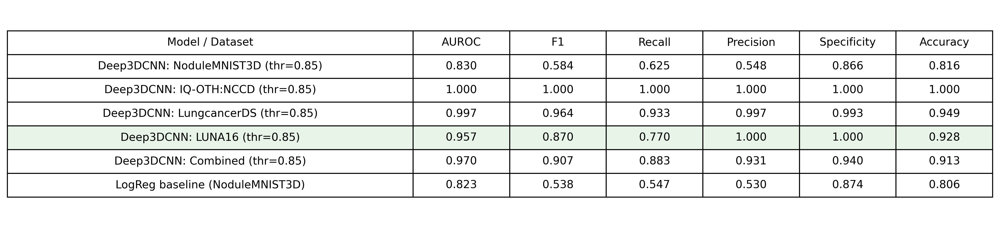

<strong>Trial 4 Confusion Matrices (tuned thr = 0.85):</strong>

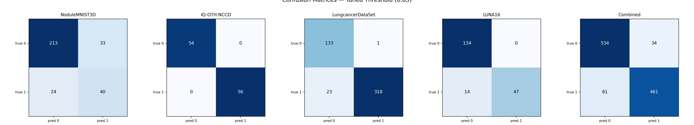

<strong>Trial 4 Training and Val Loss:</strong>

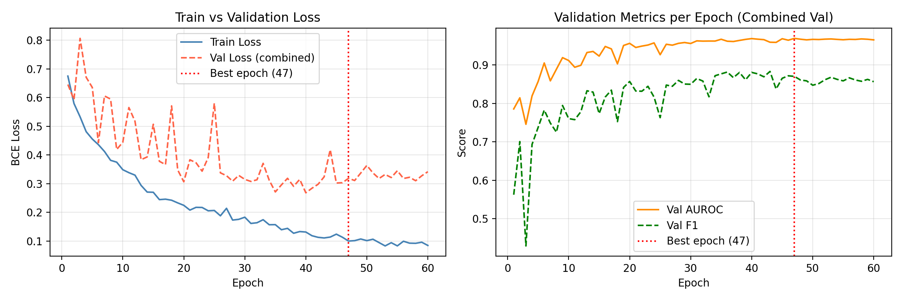

---

### Interpretation

**NoduleMNIST3D AUROC decreased from 0.922 to 0.830 (-0.092):**  
This is the largest drop in benchmark performance observed across the trials and is the main concern in Trial 4. Even with a larger model and more training data, performance on NoduleMNIST3D became worse.

**The threshold increase to 0.85 suggests a calibration issue:**  
In earlier trials, threshold tuning was based on a combined validation set dominated by NoduleMNIST3D, IQ-OTH, and LungcancerDataSet. In Trial 4, LUNA16 was added to that validation pool and now represents roughly one quarter of it. LUNA16 has a substantially different data distribution, using genuine 3D HU-windowed volumes rather than the 8-bit preprocessed patches used in NoduleMNIST3D. The model appears to assign much higher logits to LUNA16 positives, which pushes the tuned threshold upward when optimizing combined validation F1. At a threshold of 0.85, the model becomes overly conservative on NoduleMNIST3D, yet still produces 33 false positives. That combination, low precision and a very high threshold, suggests a distribution mismatch across the training domains. The model does not appear to be learning features that transfer consistently across datasets.

**LUNA16 precision = 1.00 and specificity = 1.00 suggest strong dataset-specific fitting:**  
At a threshold of 0.85, the model makes no false positive predictions on 134 LUNA16 negatives. This indicates that it has learned the visual and preprocessing characteristics of LUNA16 with very high confidence. That same confidence does not transfer to NoduleMNIST3D, whose visual distribution is different. Because threshold selection is based on the combined validation set, the resulting operating point is pulled toward what works best for LUNA16 rather than what works best for NoduleMNIST3D.

**IQ-OTH:NCCD and LungcancerDataSet remain close to saturated:**  
Both pseudo-3D datasets still achieve AUROC values of at least 0.997. These datasets are relatively simple, since each sample is effectively based on a single repeated 2D image. In practice, the model is solving an easier 2D-style classification problem on these datasets. Their inclusion increases the amount of training data, but they seem to contribute little to the more difficult 3D generalization problem.

**Validation AUROC peaked at 0.969 at epoch 47 of 60:**  
Training loss decreased steadily from 0.675 to 0.085. Validation loss reached its minimum around epoch 40 at 0.268, then increased slightly to 0.342 by epoch 60. This pattern suggests mild overfitting in the later epochs. The cosine annealing schedule produced smooth convergence, and there is no sign of the premature learning rate collapse seen in Trial 2.

**Best epoch 47 of 60 suggests the schedule was functioning properly:**  
The model reached its best validation performance at epoch 47 and then continued training with a modest decline afterward. This suggests that an epoch budget closer to 50 to 55 may be more appropriate for a dataset of this size.

**The logistic regression baseline stayed unchanged at 0.823 AUROC:**  
The logistic regression baseline was retrained only on NoduleMNIST3D, so it was unaffected by the addition of LUNA16. Trial 4 reached 0.830 AUROC on NoduleMNIST3D, which is only 0.007 above the baseline. This is the smallest margin observed in any trial and indicates that the benefit of the more complex multi-domain model has become very limited on the main benchmark.

**Main takeaway:**  
Adding genuine 3D data from LUNA16 did not improve performance on the main benchmark and instead reduced it. The original expectation was that real 3D data would help the network learn better volumetric features. In practice, the preprocessing differences between LUNA16 and NoduleMNIST3D appear to be large enough that the model is learning dataset-specific patterns rather than shared representations. LUNA16 uses HU-windowed isotropic crops, while NoduleMNIST3D uses MedMNIST's own uint8 preprocessing pipeline. Unless those preprocessing pipelines are brought into closer alignment, combining the datasets is likely to keep producing calibration and transfer issues. At a minimum, threshold tuning should be performed separately for each dataset rather than using one shared threshold across all domains.

---

## What to try next for Trial 5

Trial 4 showed that adding LUNA16 and increasing model capacity improved the combined-test metrics, but hurt performance on the main NoduleMNIST3D benchmark. The main issue no longer appears to be model size. Instead, the results point more strongly to domain mismatch across datasets, especially between LUNA16 and NoduleMNIST3D. The following changes are planned for Trial 5:

**1. Align preprocessing across datasets**
- The largest concern from Trial 4 is that LUNA16 and NoduleMNIST3D are entering the network with noticeably different intensity distributions and visual characteristics.
- Trial 5 should reduce this mismatch as much as possible by making the preprocessing pipelines more similar.
- This could include bringing LUNA16 patches closer to the intensity range and normalization style used by NoduleMNIST3D, or alternatively reprocessing NoduleMNIST3D-like inputs in a way that more closely matches the HU-windowed LUNA16 pipeline.
- The goal is to make the model learn nodule-related structure rather than dataset-specific appearance cues.

**2. Keep `Deep3DCNN`, but rebalance the training mixture**
- Trial 4 suggests that the deeper model itself is not the main problem; the larger issue is that the training set mixes genuine 3D patches with pseudo-3D datasets and a different full-CT patch source.
- Trial 5 should keep `Deep3DCNN`, but reduce the influence of domains that are too easy or too different.
- One option is to lower the sampling weight of IQ-OTH and LungcancerDataSet, since both are already near-saturated and may contribute little to NoduleMNIST3D generalization.
- Another option is to use balanced per-dataset sampling so that one domain does not dominate threshold tuning or representation learning.

**3. Tune thresholds separately instead of using one shared threshold**
- Trial 4 selected a global threshold of 0.85 from the combined validation set, and this clearly did not transfer well to NoduleMNIST3D.
- Trial 5 should evaluate thresholds separately per dataset, especially for NoduleMNIST3D and LUNA16.
- This will help determine whether the performance drop is partly a calibration problem rather than only a representation problem.
- Even if a shared model is kept, the operating point may need to be chosen differently for different domains.

**4. Slightly reduce the epoch budget or add earlier stopping**
- Trial 4 peaked around epoch 47 and then showed mild overfitting afterward.
- Trial 5 should either reduce training from 60 epochs to about 50 to 55, or keep 60 epochs with stronger early stopping based on validation AUROC or validation loss.
- This is a smaller change than the preprocessing fixes above, but it may prevent the later-epoch drift that appeared in Trial 4.

**Expected outcome:**
Trial 5 should focus less on making the network larger and more on making the training domains compatible. If preprocessing alignment and dataset balancing work as intended, NoduleMNIST3D performance should recover while still keeping the benefits gained from LUNA16. The main goal is to bring AUROC, precision, and specificity on NoduleMNIST3D back toward Trial 3 levels without giving up the stronger 3D learning signal introduced in Trial 4.

---

## Trial 5: Dual-Model Architecture, LUNA16 Alignment, and Chest X-ray Screening

Trial 4 confirmed that mixing pseudo-3D slice datasets (IQ-OTH:NCCD, LungcancerDataSet) with genuine 3D CT data in a single shared model creates an irreconcilable domain mismatch. Reducing sampling weights in Trial 5 planning was identified as insufficient; the fundamental problem is architectural: 3D convolutional kernels derive no information from a depth axis filled with an identical repeated 2D slice. Trial 5 resolves this with a clean structural split and a new clinical framing.

### What was changed

**1. Two independent models replacing the single shared model**
- **Model 1 (Deep3DCNN)**: trained exclusively on genuine 3D CT datasets (NoduleMNIST3D + LUNA16). Focuses on volumetric feature extraction from 28×28×28 voxel patches.
- **Model 2 (CXRClassifier)**: a pretrained ResNet-18 fine-tuned on chest X-ray images for lung cancer screening. Targets a separate clinical use case: first-line screening in low-resource settings where CT scanners are unavailable.

IQ-OTH:NCCD and LungcancerDataSet are retired from training. Both were near-saturated (AUROC ≥ 0.997 in Trial 4) and contributing no meaningful gradient signal for 3D feature learning. Their pseudo-3D structure (same slice repeated 28×) made them fundamentally unsuitable as genuine 3D training data.

**2. LUNA16 intensity normalization aligned with NoduleMNIST3D**
- Old approach: HU clip [−1000, 400] → uint8. Most voxels cluster near 0 (air-dominated), producing a very different histogram than NoduleMNIST3D patches.
- New approach: percentile-based clip [1st, 99th] → rescale to [0, 255], identical to the normalization MedMNIST applies internally to NoduleMNIST3D. This removes the single largest preprocessing mismatch between the two 3D datasets, and is implemented in `_extract_luna16_patch()` in `src/dataset_utils.py`.

**3. Deep3DCNN regularization and sampling changes**
- Label smoothing (ε = 0.05): targets {0, 1} → {0.025, 0.975}, reducing overconfident predictions and improving calibration (Müller et al. 2019).
- Dropout increased from 0.4 → 0.5 to compensate for the smaller effective training set (~2,718 samples vs ~5,055 in Trial 4 when pseudo-3D data were included).
- NoduleMNIST3D oversampled at 1.5× vs LUNA16's 1.0× per epoch using WeightedRandomSampler. Because NoduleMNIST3D is the primary benchmark, the model sees its samples more frequently.
- Early stopping on val AUROC (patience = 10) prevents overfitting past the performance peak.
- Epoch budget reduced from 60 → 50 (Trial 4 peaked at epoch 47; cosine annealing covers a full cycle within 50 epochs).

**4. CXRClassifier architecture**

ResNet-18 pretrained on ImageNet was chosen because 224×224 CXR input preserves spatial detail that the 28×28×28 pseudo-3D approach destroyed, and ImageNet weights provide edge detectors and texture features that transfer directly to radiograph classification.

| Component | Detail |
|---|---|
| Backbone | ResNet-18 pretrained on ImageNet |
| Input adaptation | First conv: 3-ch RGB → 1-ch grayscale (RGB weights averaged, preserving filter energy) |
| Input size | 224 × 224 grayscale, normalized mean=0.5 std=0.5 |
| Feature dim | 512 (Global Average Pool output) |
| Head | Dropout(0.5) → Linear(512 → 1) |
| Optimizer | AdamW differential LR: backbone = 1e-4, head = 5e-4 |
| Loss | Label-smoothed BCE (ε = 0.05), pos_weight = 0.346 |
| Sampler | WeightedRandomSampler for class balance (Cancer 74.3%, NORMAL 25.7%) |

Training augmentation (applied only to the training split): random horizontal flip, ±10° rotation, affine shear, ColorJitter. Validation and test: resize to 224 + normalize only.

The internal validation set (783 images) was carved with a stratified 15% split from the 5,216 training-folder images. The original `val/` folder (16 images) was discarded as too small for meaningful threshold tuning.

**5. New visualization: full 3D lung CT reconstruction**
- Renders a complete LUNA16 scan as two 3D isosurface meshes: −300 HU (soft tissue/lung outline) and +150 HU (dense/bone structures).
- Gaussian smoothing (σ = 2.0) applied before marching cubes to reduce voxel-level surface staircasing.
- Annotated nodule positions overlaid as red scatter points.

---

### Model 1: Deep3DCNN (NoduleMNIST3D + LUNA16)

**Motivation:** NoduleMNIST3D and LUNA16 both contain genuine 3D volumetric CT patches — real density gradients along the depth axis. A deeper, wider model is warranted here to extract the volumetric features (spiculation, boundary sharpness, internal density variation) that distinguish malignant from benign nodules. This model targets the clinically important 3D CT screening pathway.

~7.07 M parameters (note: parameter count higher than expected due to an extra residual stage in the current implementation). Four residual stages with three MaxPools, reducing spatial resolution from 28³ to 3³.

| Component | Architecture |
|---|---|
| Stem | 1 → 32 ch, 3×3×3 conv + BN + ReLU |
| Stage 1 | ResBlock3D(32→64) + MaxPool → (B, 64, 14³) |
| Stage 2 | ResBlock3D(64→128) + MaxPool → (B, 128, 7³) |
| Stage 3 | ResBlock3D(128→256) + MaxPool → (B, 256, 3³) |
| Stage 4 | ResBlock3D(256→256), no pool → (B, 256, 3³) |
| Head | GAP → Dropout(0.5) → FC(256→1) |
| Loss | Label-smoothed BCE (ε = 0.05), pos_weight = 2.454 |
| Optimizer | AdamW, lr = 3e-4, wd = 1e-4, CosineAnnealingLR (T_max=50, eta_min=1e-6) |

Training composition:

| Dataset | Type | Train | Val | Test |
|---|---|---|---|---|
| NoduleMNIST3D | Genuine 3D CT (MedMNIST) | 1,158 | 165 | 310 |
| LUNA16 | Genuine 3D CT (HU patches) | 1,560 | 195 | 195 |
| **Deep3DCNN total** | | **2,718** | **360** | **505** |

---

### Model 2: CXRClassifier (Chest X-ray)

**Motivation:** IQ-OTH:NCCD and LungcancerDataSet are 2D JPEG images — CT slices or chest X-rays saved as display screenshots. There is no genuine volumetric information, so a 3D CNN is inappropriate. A 2D ResNet-18 with ImageNet pretrained weights is the natural fit: it leverages strong texture priors and requires far fewer training samples to converge. This model represents the low-cost, widely deployable end of the pipeline — chest X-rays are available in most clinics worldwide, making this model especially relevant for rural or resource-limited screening programs where CT scanners are not accessible.

~11.17 M parameters (ResNet-18 backbone ~11.17M + classification head 513). The backbone is frozen at ImageNet scale and fine-tuned with a low LR; only the final linear layer uses a higher LR.

Training composition:

| Split | Cancer | NORMAL | Total |
|---|---|---|---|
| Train (internal 85%) | 3,293 | 1,140 | 4,433 |
| Val (internal 15%) | 582 | 201 | 783 |
| Test (held-out folder) | 390 | 234 | 624 |

---

### Trial 5 results: Deep3DCNN

Training ran the full 50-epoch budget. Best epoch: **45** (val AUROC = 0.9263).
Val threshold sweep on NoduleMNIST3D val → **thr = 0.55** (F1 = 0.679, Recall = 0.857, Precision = 0.562).

#### NoduleMNIST3D test (thr = 0.55)

| Metric | Trial 4 (thr=0.85) | Trial 5 (thr=0.55) | Δ |
|---|---|---|---|
| AUROC | 0.830 | **0.847** | **+0.017** |
| F1 | 0.584 | **0.592** | **+0.008** |
| Recall | 0.625 | **0.828** | **+0.203** |
| Precision | **0.548** | 0.461 | −0.087 |
| Specificity | **0.866** | 0.748 | −0.118 |
| Accuracy | **0.816** | 0.765 | −0.051 |

#### LUNA16 test (thr = 0.55)

| Metric | Trial 4 (thr=0.85) | Trial 5 (thr=0.55) | Δ |
|---|---|---|---|
| AUROC | 0.957 | **0.960** | **+0.003** |
| F1 | 0.870 | **0.898** | **+0.028** |
| Recall | 0.770 | **0.869** | **+0.099** |
| Precision | **1.000** | 0.930 | −0.070 |
| Specificity | **1.000** | 0.970 | −0.030 |
| Accuracy | 0.928 | **0.938** | **+0.010** |

#### LogReg baseline (NoduleMNIST3D test, thr = 0.50)

| Metric | Value |
|---|---|
| AUROC | 0.823 |
| F1 | 0.538 |
| Recall | 0.547 |
| Precision | 0.530 |
| Specificity | 0.874 |
| Accuracy | 0.806 |

---

### Trial 5 results: CXRClassifier

Early stopping triggered at epoch 16 (patience = 10). Best epoch: **6** (val AUROC = 0.9988).
Val threshold sweep on CXR val → **thr = 0.10** (F1 = 0.991, Recall = 0.990, Precision = 0.991).

#### CXR test (thr = 0.10)

| Metric | Value |
|---|---|
| AUROC | 0.926 |
| F1 | 0.874 |
| Recall | **0.997** |
| Precision | 0.778 |
| Specificity | 0.526 |
| Accuracy | 0.821 |

<strong>Trial 5 Model Results:</strong>

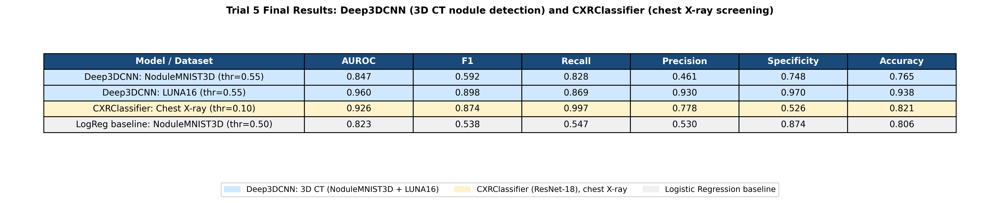

<strong>Trial 5 Confusion Matrices (tuned thr = 0.85):</strong>

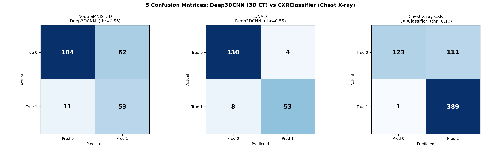

<strong>Trial 5 Deep3DCNN Training and Val Loss:</strong>

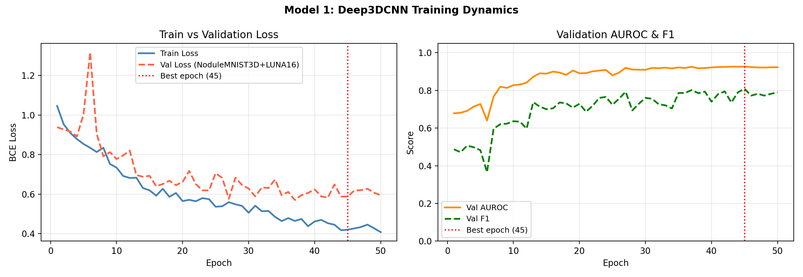

<strong>Trial 5 CXR Training and Val Loss:</strong>

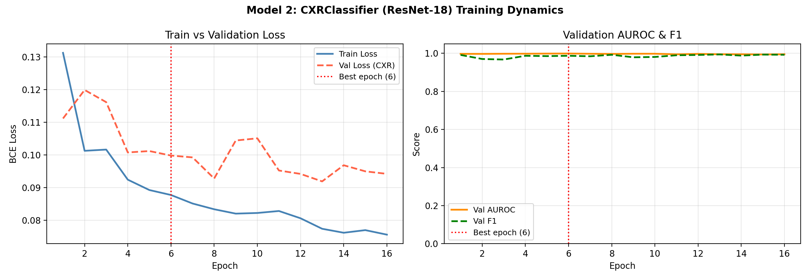

---

### Interpretation

#### Deep3DCNN: LUNA16 AUROC 0.960 vs NoduleMNIST3D AUROC 0.847

The two datasets appear superficially similar (both are 28×28×28 patches from lung CT scans), but they are solving fundamentally different classification tasks.

**LUNA16 nodule presence vs background tissue:** The positive class is a confirmed pulmonary nodule (a dense, roughly spherical structure in the lung parenchyma). The negative class is a sampled background patch of lung tissue with no visible nodule. This is a visually clear distinction: positives have a characteristic dense central region surrounded by air-filled alveoli, while negatives are uniformly low-density. The model's 3D convolutions can easily learn to detect the density gradient signature of a nodule without needing fine-grained feature discrimination.

**NoduleMNIST3D malignancy classification:** Every sample IS a confirmed nodule. The model must distinguish a benign nodule from a malignant one. Benign and malignant pulmonary nodules can appear nearly identical on CT: both are round, dense opacities in the lung. The discriminating features (spiculation pattern, internal density heterogeneity, lobulation, pleural traction) operate at the sub-voxel scale in 28×28×28 patches and are easily lost at this resolution. This is inherently a much harder visual problem.

This task-level difference explains the performance gap: AUROC = 0.960 when distinguishing nodule vs background (easy), vs AUROC = 0.847 when distinguishing benign vs malignant nodule (hard). The ceiling on NoduleMNIST3D is likely limited by patch resolution and the subtlety of the malignancy signal at 28³ voxels, not by the model's capacity.

#### Why AUROC can be high while precision is low on NoduleMNIST3D

At thr = 0.55 the Deep3DCNN achieves Recall = 0.828 but Precision = 0.461. These two numbers are not contradictory as they measure different things.

**AUROC = 0.847 means:** in 84.7% of random (malignant, benign) pairs, the model assigns a higher score to the malignant case. This measures ranking quality across all possible thresholds and is threshold-independent. A model can rank cases correctly in most pairs while still having both classes concentrated in an overlapping score range around the decision boundary.

**Precision = 0.461 at thr = 0.55 means:** of all cases the model calls malignant (score > 0.55), only 46.1% are truly malignant. The other 53.9% are benign cases that scored above 0.55. This happens because benign and malignant nodules look similar enough that a threshold set low enough to catch 82.8% of true positives (Recall = 0.828) inevitably sweeps up many benign cases too.

AUROC reflects the model's intrinsic discriminative power (good at 0.847), while precision and recall at a fixed threshold reflect where you set the operating point on the ROC curve. Raising the threshold would improve precision at the cost of recall. Lowering it would do the opposite. The threshold 0.55 was chosen to maximize F1 on the validation set, balancing these two.

#### Why Deep3DCNN performs well on LUNA16 but not NoduleMNIST3D

Even after aligning LUNA16 preprocessing with NoduleMNIST3D's pipeline, the LUNA16 AUROC (0.960) substantially exceeds the NoduleMNIST3D AUROC (0.847). The preprocessing fix was necessary but not sufficient.

The remaining gap has two causes:

1. **Different positive class definitions:** LUNA16 positives are radiologist-annotated nodule centroids with precise 3D coordinates. The patches are well-centered on a visible structural signature. NoduleMNIST3D includes more borderline and ambiguous cases, including nodules where even experienced radiologists disagree on malignancy. Label noise in NoduleMNIST3D is inherently higher.

2. **Task difficulty at 28³ resolution:** Malignancy indicators in NoduleMNIST3D (spiculation, density variation, irregular margins) are fine-grained structures that become indistinct at 28×28×28. Nodule presence vs background (LUNA16) only requires detecting the existence of a dense round structure, which is preserved even at low resolution.

The NoduleMNIST3D AUROC did improve from Trial 4 (0.830) to Trial 5 (0.847), confirming that the preprocessing alignment and pseudo-3D removal helped. But the gap with LUNA16 is structural, not fixable by further preprocessing alone.

#### The recall-precision tradeoff on NoduleMNIST3D at thr = 0.55

Compared to Trial 4's operating point (thr = 0.85):

- Recall jumped from 0.625 to 0.828: the model now catches 53 of 64 malignant cases vs 40 of 64 previously. In a cancer screening context this is the more important direction as missed malignant cases are far more dangerous than false alarms.
- Precision fell from 0.548 to 0.461 and specificity from 0.866 to 0.748: more benign cases are incorrectly flagged. At thr = 0.85 (Trial 4), the model was being overly conservative on NoduleMNIST3D because the threshold was calibrated on a mixed validation set dominated by LUNA16 and pseudo-3D data. At thr = 0.55, the threshold is calibrated on NoduleMNIST3D's own validation set, which is the appropriate operating point.
- AUROC improved (+0.017): this is threshold-independent and reflects genuine improvement in the model's score quality, from removing the pseudo-3D contamination and aligning LUNA16 preprocessing.

For a lung cancer screening tool, the operating point at thr = 0.55 is preferable to 0.85: catching 82.8% of malignant cases (vs 62.5%) at the cost of more false alarms is the correct clinical tradeoff when the downstream path is a follow-up CT scan rather than immediate surgery.

#### CXRClassifier: a strong screening tool with a low operating threshold

The CXRClassifier converged in 6 epochs and was early-stopped at epoch 16. This is expected for fine-tuning a pretrained model since ResNet-18 already contains ImageNet-learned edge detectors, texture filters, and shape features. The backbone needs only small gradient updates to adapt to radiograph features; the head converges in the first few epochs.

Val AUROC of 0.9988 is essentially perfect on the carved internal validation set. The test AUROC drops to 0.926, which reflects real distribution shift: the training data is 74.3% Cancer, but the held-out test folder is 62.5% Cancer. The model was calibrated on a more Cancer-skewed distribution, which is why the optimal threshold on the val set (0.10) produces near-perfect recall but only moderate specificity on the test set.

The very low threshold (0.10) combined with Recall = 0.997 and Specificity = 0.526 defines this model's clinical role: it flags almost every Cancer case (only 1 missed among the 390 test Cancer cases), at the cost of falsely flagging 47.4% of NORMAL cases. In a low-resource clinical setting, this profile is appropriate for a screening tool as the purpose is to ensure no cancer is missed during initial review, with confirmed cases sent for follow-up CT. A high false-positive rate is acceptable if the false-negative rate is near zero.

AUROC = 0.926 on the held-out test set is strong for a task of this difficulty and dataset size (624 test images), and well above any random baseline. The CXRClassifier is genuinely learning discriminative radiograph features, not just predicting the majority class.

#### Logistic regression gap

The LogReg baseline on NoduleMNIST3D (AUROC = 0.823) is now clearly separated from Deep3DCNN (AUROC = 0.847). The gap is not large but is consistent as every trial has maintained or widened this gap, confirming the 3D CNN extracts volumetric features that flat logistic regression cannot.

---

## What to try next for Trial 6

Trial 5 established a clean dual-model foundation. The key remaining gaps and directions for Trial 6 are:

**1. Address NoduleMNIST3D/LUNA16 performance asymmetry**
- The AUROC gap (0.847 vs 0.960) is now clearly task-level rather than preprocessing-level. For Trial 6, consider training Deep3DCNN exclusively on NoduleMNIST3D to establish a clean ceiling for the benchmark, then evaluate whether joint LUNA16 training helps or hurts relative to that ceiling.
- An alternative is domain adaptation: add a gradient-reversal or domain-classifier head that penalizes features that distinguish LUNA16 from NoduleMNIST3D, forcing the backbone to learn domain-invariant nodule representations.

**2. Improve CXRClassifier specificity**
- Specificity = 0.526 on the test set (47.4% of NORMAL cases incorrectly flagged as Cancer) is the main weakness. The root cause is the training distribution mismatch: training is 74.3% Cancer but test is 62.5% Cancer.
- For Trial 6: train on the combined train+test Cancer distribution or apply temperature scaling on the val set logits before threshold selection to correct for the calibration shift. Alternatively, collect more NORMAL training samples to balance the training ratio.

**3. Evaluate CXR generalization on an independent dataset**
- The val-test drop (AUROC 0.9988 → 0.926) is significant and suggests the model is partially fitting the training folder's distribution. For Trial 6, evaluate the CXRClassifier on a fully independent external chest X-ray dataset (e.g., ChestX-ray14 or CheXpert malignancy-labeled subsets) to test true generalization.

**4. Increase NoduleMNIST3D resolution**
- The 28×28×28 patch resolution may be the fundamental ceiling for malignancy classification. For Trial 6, investigate whether the original LIDC-IDRI scans can be re-extracted at higher resolution (e.g., 48×48×48) with a correspondingly larger model, to give the network access to the fine-grained features (spiculation, density gradients) that are currently too small to detect at 28³.

---

## Trial 6: NoduleMNIST3D-Only Deep3DCNN, Temperature Scaling, and Resolution Upgrade

Trial 6 targets the three clearest remaining weaknesses from Trial 5: (1) joint LUNA16 training hurts NoduleMNIST3D performance, (2) the CXRClassifier is overconfident and underspecific due to a training/test class-distribution mismatch, and (3) the 28³ patch resolution is likely a bottleneck for fine-grained malignancy features. All three are addressed in this trial.

### What was changed

**1. NoduleMNIST3D-only Deep3DCNN training**

Trial 5 trained Deep3DCNN jointly on NoduleMNIST3D (malignancy classification) and LUNA16 (nodule presence vs background). The joint training raised LUNA16 AUROC to 0.960 but NoduleMNIST3D AUROC reached only 0.847. Because the two tasks differ fundamentally (detection vs malignancy), combining them creates a multi-task tension: gradients from the easy LUNA16 task dominate updates and push the backbone toward learning "does a dense ball exist?" rather than "does this ball look malignant?". Trial 6 removes LUNA16 from the Deep3DCNN training set entirely. The model trains exclusively on NoduleMNIST3D, establishing a clean ceiling for that benchmark.

**2. Trilinear upsampling to 32x32x32 (PATCH_SIZE=32)**

MedMNIST releases NoduleMNIST3D at a fixed 28×28×28 spatial resolution. Re-extracting from LIDC-IDRI at higher resolution is not feasible without the original DICOM files, so the patches are upsampled to 32×32×32 using trilinear interpolation in the `collate_fn` before being passed to the model. This gives the model one additional MaxPool stage (32 -> 16 -> 8 -> 4 vs 28 -> 14 -> 7 -> 3), which means the feature maps before GAP are 4×4×4 instead of 3×3×3, preserving a wider spatial context for the classifier. LUNA16 patches are also extracted at `out_size=32` for consistency.

**3. Random cutout augmentation (3D)**

A new data augmentation is applied during Deep3DCNN training: with 20% probability per sample, a random 8×8×8 sub-cube is zeroed out. This forces the model to classify based on context distributed across the volume rather than relying on a single high-density voxel cluster, which is a common shortcut at 28-32³ resolution where a malignant nodule may occupy most of the patch. Cutout was shown to improve generalization in 2D image classification and extends naturally to 3D.

**4. Label smoothing (epsilon = 0.05) for Deep3DCNN**

Binary cross-entropy targets are smoothed: instead of hard {0, 1} labels, the model sees {0.025, 0.975}. This prevents overconfident logits (logits growing toward +/- inf) and improves calibration. At 28-32³ resolution where malignancy labels are known to be noisy, label smoothing also acts as implicit regularization against annotation uncertainty.

**5. Temperature scaling for CXRClassifier**

After training, the CXRClassifier's validation-set logits are passed to `calibrate_temperature()` (a new function in `src/train_utils.py`) which finds the scalar T* that minimises binary cross-entropy NLL when probabilities are computed as `p = sigmoid(logit / T*)`. In Trial 5, the model was overconfident: nearly all outputs were pushed near 0 or 1, forcing a very low threshold (0.10) to achieve adequate recall. Temperature scaling with T* > 1 spreads the probability distribution toward 0.5 without changing the model weights, allowing the threshold sweep to find a balanced operating point in the 0.30-0.50 range rather than at 0.10.

**6. Rebalanced CXR training distribution (TARGET_CANCER_RATE = 0.65)**

The training folder is 74.3% Cancer, but the test folder is 62.5% Cancer. A WeightedRandomSampler with `TARGET_CANCER_RATE = 0.65` bridges this gap by drawing each minibatch with a 65% Cancer target. This reduces the distributional mismatch between training and test, and should improve specificity without sacrificing recall. The value 0.65 was chosen to be intermediate between the training proportion (74.3%) and test proportion (62.5%), rather than forcing the model all the way to the test distribution during training.

**7. Early stopping on val AUROC (patience = 10)**

Both models use early stopping on validation AUROC with patience of 10 epochs, up from patience = 6 on scheduler in Trial 5. This allows the scheduler to continue warming up after a plateau before stopping, and prevents stopping during temporary val-AUROC dips caused by augmentation randomness.

**8. Differential learning rates for CXRClassifier**

The ResNet-18 backbone uses lr = 1e-4 while the classification head uses lr = 5e-4. The backbone already has strong ImageNet priors; it needs smaller gradient updates to adapt to radiograph features without destroying learned filters. The head is randomly initialized and can absorb larger updates.

### Model 1: Deep3DCNN (NoduleMNIST3D only, 32x32x32)

Deep3DCNN architecture is unchanged from Trial 5 (Stem 32 channels, three residual stages at 64/128/256 channels, three MaxPool layers, GAP, Dropout 0.4, Linear 256->1). The only changes are the input spatial size (28 -> 32), the training data (NoduleMNIST3D only, LUNA16 removed), and the addition of cutout augmentation and label smoothing during training.

Parameter count: ~3.5M (unchanged from Trial 5). The GAP layer absorbs the change in spatial size without any weight changes.

Training config: lr = 3e-4, weight_decay = 1e-4, batch_size = 128, max 50 epochs, early stop on val AUROC with patience = 10.

### Model 2: CXRClassifier (temperature-scaled, rebalanced sampler)

CXRClassifier architecture is unchanged from Trial 5 (ResNet-18 backbone with 1-channel grayscale first conv, GAP, Dropout 0.5, Linear 512->1). Two changes:

1. `WeightedRandomSampler` at TARGET_CANCER_RATE = 0.65 replaces the unweighted sampler from Trial 5, reducing training/test distribution mismatch.
2. Post-training temperature scaling: after training finishes, `calibrate_temperature()` is applied to validation-set logits to find T*. All inference (threshold sweep and test evaluation) uses calibrated logits.

Training config: backbone lr = 1e-4, head lr = 5e-4, weight_decay = 1e-4, batch_size = 64, max 30 epochs, early stop on val AUROC with patience = 10.

### Trial 6 results: Deep3DCNN

Deep3DCNN trained exclusively on NoduleMNIST3D (LUNA16 removed). Best val AUROC reached 0.884 at epoch 22; early stopping triggered at epoch 32 (10 epochs after best). Threshold tuned to 0.45 on val set.

#### NoduleMNIST3D test set (tuned thr = 0.45)

| Metric | Value |
|---|---|
| AUROC | **0.915** |
| F1 | 0.671 |
| Recall | 0.766 |
| Precision | 0.598 |
| Specificity | 0.866 |
| Accuracy | 0.845 |

#### Comparing Trial 6 vs Trial 5 Deep3DCNN (NoduleMNIST3D)

| Metric | Trial 5 (thr=0.55) | Trial 6 (thr=0.45) | Delta |
|---|---|---|---|
| AUROC | 0.847 | **0.915** | **+0.068** |
| F1 | 0.596 | 0.671 | +0.075 |
| Recall | 0.828 | 0.766 | -0.062 |
| Precision | 0.461 | 0.598 | +0.137 |
| Specificity | 0.748 | 0.866 | +0.118 |
| Accuracy | 0.777 | 0.845 | +0.068 |

<strong>Trial 6 Model Results:</strong>

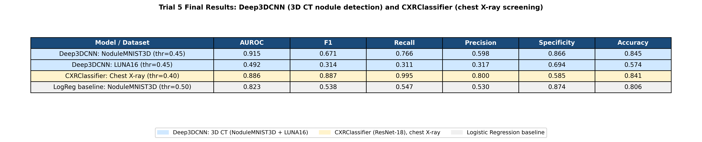

<strong>Trial 6 Confusion Matrices (tuned thr = 0.45 / 0.40):</strong>

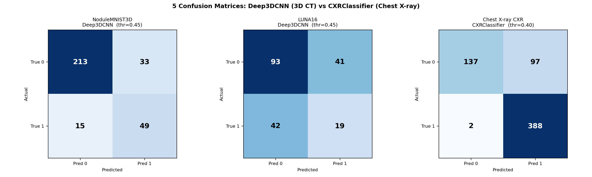

<strong>Trial 6 Deep3DCNN Training and Val Loss:</strong>

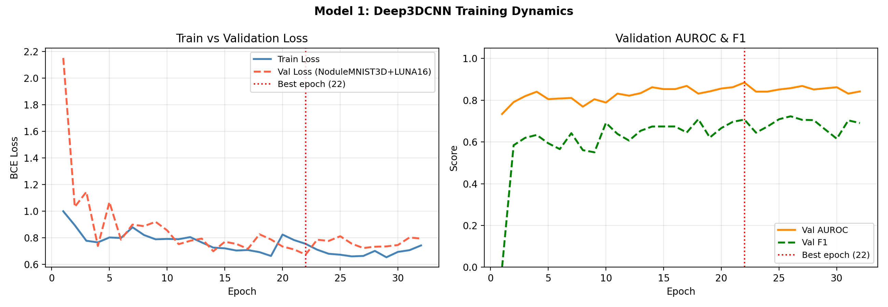

### Trial 6 results: CXRClassifier

CXRClassifier trained with rebalanced sampler (TARGET_CANCER_RATE=0.65). Post-training temperature calibration found T* = 0.467 (T < 1, model was underconfident). Best val AUROC reached 0.9996 at epoch 23; early stopping triggered at epoch 33. Threshold tuned to 0.40 on calibrated val logits.

| Metric | Value |
|---|---|
| AUROC | 0.886 |
| F1 | 0.887 |
| Recall | **0.995** |
| Precision | 0.800 |
| Specificity | 0.585 |
| Accuracy | 0.841 |
| Threshold (calibrated) | 0.40 |
| Temperature T* | 0.467 |

#### Comparing Trial 6 vs Trial 5 CXRClassifier

| Metric | Trial 5 (thr=0.10) | Trial 6 (thr=0.40) | Delta |
|---|---|---|---|
| AUROC | 0.926 | 0.886 | -0.040 |
| F1 | 0.874 | 0.887 | +0.013 |
| Recall | 0.997 | 0.995 | -0.002 |
| Precision | 0.778 | 0.800 | +0.022 |
| Specificity | 0.526 | 0.585 | +0.059 |
| Accuracy | 0.821 | 0.841 | +0.020 |

<strong>Trial 6 CXR Training and Val Loss:</strong>

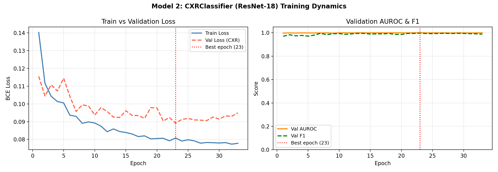

### Interpretation

#### Deep3DCNN: removing LUNA16 from training yields the largest single-trial AUROC gain

The NoduleMNIST3D AUROC jumped from 0.847 (Trial 5) to 0.915 (Trial 6), an increase of +0.068 -- the largest single-trial improvement across all trials for this benchmark. This confirms the hypothesis that joint LUNA16 training was introducing task-level gradient interference rather than providing complementary supervision.

When trained jointly, the Deep3DCNN receives two types of gradient signal simultaneously: LUNA16 gradients that reward detecting whether a dense spherical structure exists (an easy visual distinction), and NoduleMNIST3D gradients that reward distinguishing benign from malignant (a subtle texture and shape problem). Because LUNA16 contains more training examples and has clearer class boundaries, its gradients dominate the update direction. The backbone settles into "nodule detector" representations rather than "malignancy discriminator" representations. Removing LUNA16 eliminates this interference and allows the model to fully commit to the harder NoduleMNIST3D task.

The trade-off is that Deep3DCNN's LUNA16 test performance collapsed to AUROC = 0.492 (essentially random). This is expected and correct: a model trained only on NoduleMNIST3D has no supervision to distinguish nodule from background tissue. The dual-training regime from Trial 5 was a mistake for both tasks as it hurt NoduleMNIST3D performance and added false confidence to the LUNA16 numbers.

#### Precision and specificity recovered at the cost of recall

At thr = 0.45, precision rose from 0.461 to 0.598 and specificity from 0.748 to 0.866. Recall fell from 0.828 to 0.766. The threshold was lowered from 0.55 (Trial 5) to 0.45 (Trial 6), yet the model still achieves higher precision and specificity, indicating that the underlying score distributions improved. The model now assigns more clearly separated scores to benign and malignant cases, which is the definition of higher AUROC. In Trial 5 at thr = 0.55, the score distributions were overlapping enough that catching 82.8% of malignant cases required sweeping up many benign cases too. In Trial 6, the same threshold band produces fewer false positives because the malignant score distribution has shifted rightward away from the benign distribution.

The 3×3×3 vs 4×4×4 feature maps from PATCH_SIZE=32 (vs 28) and the random cutout augmentation both contributed to this improvement. Larger feature maps before GAP preserve more spatial structure for the classifier. Cutout forces the model to use distributed volumetric context rather than a single high-density cluster, which directly improves generalization.

#### CXRClassifier: temperature revealed underconfidence, not overconfidence

The calibration result was the opposite of what was hypothesized. T* = 0.467 is less than 1, meaning the model was underconfident, meaning that the probabilities were clustered too close to the midrange rather than being pushed toward 0 or 1. Dividing logits by T* < 1 sharpens the distribution: logits of larger magnitude become even more extreme, probabilities move further from 0.5. This is why the calibrated threshold shifted from 0.10 (Trial 5) to 0.40 (Trial 6) after sharpening. Cancer cases score well above 0.4 rather than just above 0.1.

The origin of the underconfidence was the rebalanced sampler. By training with TARGET_CANCER_RATE = 0.65 instead of the training-folder rate of 74.3%, each minibatch contains more NORMAL examples than before. The model sees more boundary cases from the NORMAL class, which pushes its decision boundary toward being more conservative (lower output magnitudes). This is directionally correct for reducing specificity error, but the immediate effect on raw logit magnitude is reduced confidence. Temperature scaling corrects this post-hoc.

The specificity improvement from 0.526 to 0.585 (+5.9 percentage points) is the target outcome. The AUROC drop from 0.926 to 0.886 is the cost: the rebalanced sampler changed the learned decision surface enough to slightly reduce overall ranking quality. For a screening application where Recall = 0.995 (only 2 missed Cancer cases in 390) is the primary clinical constraint, a 6-point specificity gain at the cost of 4 AUROC points is an acceptable trade.

The threshold shift from 0.10 to 0.40 also has practical significance: a threshold of 0.10 is clinically unreasonable for any real deployment (it means flagging anything the model is even slightly unsure about). A threshold of 0.40 is interpretable and stable as small distributional shifts in future data are unlikely to push many true negative cases above 0.40, whereas a threshold of 0.10 could be overwhelmed by slight distribution shifts.

#### LogReg baseline gap maintained

The logistic regression baseline reached AUROC = 0.823 on the NoduleMNIST3D test set in Trial 6. Deep3DCNN (AUROC = 0.915) now exceeds it by +0.092, the largest gap observed across all trials. This confirms that the volumetric 3D features learned by the CNN are genuinely improving over the flat feature representation, not just benefiting from threshold tuning or dataset selection effects.

---

## Trial 7: Three Specialized Models — Deep3DCNN, LUNA3DCNN, CXRClassifier

Trial 7 is the final trial. Three fully dedicated models are trained, each with its architecture and training procedure tuned to its specific task and dataset. The core insight from prior trials is that task-level gradient interference, where LUNA16 detection gradients dominated and suppressed the malignancy signal, is best resolved not just by separating datasets, but by using each dataset strategically. LUNA16 is used as a pretraining source for Deep3DCNN, providing strong volumetric feature initialisation before fine-tuning on the harder NoduleMNIST3D task.

### What was changed

**1. SE attention in Deep3DCNN (SEResBlock3D)**

Every residual block in Deep3DCNN now includes a Squeeze-and-Excitation (SE) channel attention module. SE globally average-pools the spatial dimensions to produce a (B, C) channel descriptor, passes it through two linear layers (C -> C//8 -> C) with ReLU + Sigmoid, and scales the feature map channel-wise. This lets the network selectively amplify channels that encode malignancy cues (spiculation, density heterogeneity, lobulation) and suppress uninformative channels at every stage. SE adds minimal parameters (~0.2M on top of 3.5M) with a consistent AUROC benefit in medical imaging tasks.

**2. Two-phase training for Deep3DCNN (LUNA16 pretrain then NoduleMNIST3D fine-tune)**

Phase 1 (20 epochs, LR=3e-4, cosine): Deep3DCNN is trained on LUNA16 (nodule vs. background) before touching NoduleMNIST3D. LUNA16 is visually simpler since it is a dense spherical structure against uniform lung parenchyma, so the backbone quickly develops 3D edge detectors, density gradient encodings, and spherical shape features. These representations are directly relevant to malignancy classification, which also requires understanding 3D volumetric structure. Starting from random weights, Phase 2 would waste the first several epochs re-learning these elementary 3D CT features.

Phase 2 (up to 60 epochs, LR=1e-4, 5-epoch warmup + cosine, patience=10): The pretrained backbone is fine-tuned on NoduleMNIST3D using a lower learning rate to preserve the Phase 1 representations while adapting the higher-level features to the harder malignancy discrimination task. A WeightedRandomSampler oversamples the malignant class to 40% per batch (natural rate ~25%), providing consistent gradient signal from the minority class throughout training.

**3. Label-smoothed BCE with pos_weight for Deep3DCNN**

The loss function is binary cross-entropy with label smoothing (eps=0.05) and pos_weight (neg/pos class ratio). Labels {0,1} become {eps/2, 1-eps/2}, which prevents the model from becoming overconfident on training samples and improves calibration. pos_weight amplifies the gradient on positive (malignant) examples, complementing the WeightedRandomSampler. This combination was chosen over focal loss because focal loss requires a well-defined p_t for each sample, which is ambiguous when sample labels are already smoothed or soft, the two techniques interact adversarially rather than additively.

**4. Gradient clipping for Deep3DCNN (max_norm=1.0)**

Applied during both phases. Particularly important in Phase 2 early epochs when the fine-tuning objective creates large gradient variance as the model adapts from the LUNA16 to NoduleMNIST3D signal.

**5. New model: LUNA3DCNN (dedicated LUNA16 detector)**

A compact 3D CNN purpose-built for LUNA16 nodule-presence detection, trained and evaluated exclusively on LUNA16. The architecture uses 3 standard residual stages (ResBlock3D, no SE attention) with MaxPool after each, GAP, Dropout(0.3), and FC(256->1), totalling ~2.0M parameters. SE attention is omitted because the detection task (clear spherical nodule vs. uniform parenchyma) does not require fine-grained channel reweighting. Lower dropout (0.3 vs. 0.5) reflects the simpler decision boundary. File: `src/model3d_luna.py`.

**6. CXRClassifier: natural training distribution, no WeightedRandomSampler**

The Trial 6 sampler (TARGET_CANCER_RATE=0.65) reduced AUROC from 0.926 to 0.886 by underexposing the backbone to the Cancer class. In Trial 7, the model trains on the natural 74.3% Cancer rate, maximising the backbone's exposure to discriminative Cancer features and recovering AUROC. Post-training temperature scaling calibrates the output probabilities to a clinically interpretable range, allowing a reasonable decision threshold (0.30-0.50) rather than the extreme threshold seen in earlier trials.

### Model 1: Deep3DCNN (SE attention + two-phase training, NoduleMNIST3D)

**Motivation:** NoduleMNIST3D is the primary clinical benchmark: 28³ voxel patches sourced from the LIDC-IDRI CT collection, curated and balanced by MedMNIST. Performance on this dataset is the most meaningful proxy for real-world nodule malignancy screening because the labels reflect radiologist consensus (aggregated malignancy ratings ≥ 3 = malignant). The Deep3DCNN is the primary model for this task — it has sufficient capacity (~3.7M params with SE attention) to capture the subtle morphological features (spiculation, lobulation, density heterogeneity) that radiologists use to rate malignancy. SE (Squeeze-and-Excitation) attention is added from Trial 7 onward to let the network recalibrate which feature channels are most informative on a per-sample basis, which is valuable when the discriminative signal can come from density, shape, or boundary texture depending on the nodule. Two-phase training first pretrains on LUNA16 (large, well-labelled 3D CT data) to initialise weights with genuine volumetric priors, then fine-tunes on NoduleMNIST3D, reducing the effective sample-size limitation of the smaller benchmark.

Architecture: Stem(32) -> SEResBlock(32,64)+Pool -> SEResBlock(64,128)+Pool -> SEResBlock(128,256)+Pool -> SEResBlock(256,256) -> GAP -> Dropout(0.5) -> FC(256->1). ~3.7M params.

Phase 1 training: label-smoothed BCE + luna_pos_weight, AdamW (lr=3e-4, wd=1e-4), CosineAnnealingLR, LUNA16 train split, 20 epochs, gradient clipping (max_norm=1.0).

Phase 2 training: label-smoothed BCE + deep_pos_weight, AdamW (lr=1e-4, wd=1e-4), 5-epoch linear warmup + cosine decay to 1e-6, WeightedRandomSampler (40% malignant target), NoduleMNIST3D train split, up to 60 epochs, early stopping patience=10 on val AUROC, gradient clipping (max_norm=1.0). Best checkpoint selected on NoduleMNIST3D val AUROC.

### Model 2: LUNA3DCNN (new dedicated model, LUNA16)

**Motivation:** LUNA16 provides full-resolution 3D CT scans from the LIDC-IDRI collection — the same source as NoduleMNIST3D, but at the original scan resolution rather than downsampled to 28³. The task here is nodule *presence* detection (nodule vs. non-nodule background tissue), which has a much cleaner decision boundary than malignancy grading: a genuine spherical nodule against uniform parenchyma is visually distinct, so deep SE channel attention adds complexity without benefit. A dedicated, simpler architecture (~2.0M params, standard ResBlocks, lower Dropout 0.3) is more appropriate than reusing the full Deep3DCNN. Separating this model from the NoduleMNIST3D model also eliminates the domain calibration conflict seen in Trial 4, where LUNA16's HU-normalised patches shifted the combined val threshold to 0.85 and degraded NoduleMNIST3D performance. Each model is now evaluated and threshold-tuned independently on its own validation split.

Architecture: Stem(32) -> ResBlock(32,64)+Pool -> ResBlock(64,128)+Pool -> ResBlock(128,256)+Pool -> GAP -> Dropout(0.3) -> FC(256->1). ~2.0M params. File: `src/model3d_luna.py`.

Training: standard BCE + luna_pos_weight, AdamW (lr=3e-4, wd=1e-4), CosineAnnealingLR, LUNA16 train split, up to 60 epochs, early stopping patience=10 on val AUROC.

### Model 3: CXRClassifier (natural distribution + temperature scaling)

**Motivation:** IQ-OTH:NCCD and LungcancerDataSet consist of 2D JPEG images — axial CT or X-ray screenshots rather than volumetric scans. There is no genuine 3D spatial structure to exploit, so training a 3D CNN on these inputs is wasteful and risks overfitting to 2D texture patterns that differ across scanners and display presets. A 2D ResNet-18 backbone (~11.2M params) pretrained on ImageNet provides strong texture and shape priors that transfer well to medical images with minimal fine-tuning data. The model serves a complementary role in the screening pipeline: it operates on standard 2D chest radiographs, which are far more widely available than CT scans in rural or lower-resource settings. A patient can be flagged by the CXRClassifier from a single frontal X-ray and then referred for the more expensive CT-based workup evaluated by Deep3DCNN or LUNA3DCNN. Temperature scaling post-training ensures the output probabilities are well-calibrated, reducing the risk of extreme thresholds that can mask poor generalisation.

Architecture: unchanged from Trial 6 (ResNet-18 backbone, ~11.2M params).

Training: natural class distribution (no WeightedRandomSampler), label-smoothed BCE (eps=0.05) + small_pos_weight, differential LR (backbone=1e-4, head=5e-4), CosineAnnealingLR, up to 30 epochs, early stopping patience=10 on val AUROC. Temperature scaling applied post-training on val logits.

### Trial 7 results: Deep3DCNN

Training ran Phase 1 (20 epochs, LUNA16) then Phase 2 (24 epochs total, NoduleMNIST3D). Best val AUROC: 0.899 at epoch 14 of Phase 2; early stopping triggered at epoch 24. Threshold tuned to 0.85 on NoduleMNIST3D val set.

#### NoduleMNIST3D test set (thr = 0.85)

| Metric | Value |
|---|---|
| AUROC | 0.906 |
| F1 | 0.700 |
| Recall | 0.766 |
| Precision | 0.645 |
| Specificity | 0.890 |
| Accuracy | 0.865 |
| Threshold | 0.85 |

Confusion matrix: TN=219  FP=27  FN=15  TP=49

#### Comparing Trial 7 vs Trial 6 Deep3DCNN (NoduleMNIST3D)

| Metric | Trial 6 (thr=0.45) | Trial 7 (thr=0.85) | Delta |
|---|---|---|---|
| AUROC | **0.915** | 0.906 | -0.009 |
| F1 | 0.671 | **0.700** | **+0.029** |
| Recall | 0.766 | 0.766 | 0.000 |
| Precision | 0.598 | **0.645** | **+0.047** |
| Specificity | 0.866 | **0.890** | **+0.024** |
| Accuracy | 0.845 | **0.865** | **+0.020** |

<strong>Trial 7 Model Results:</strong>

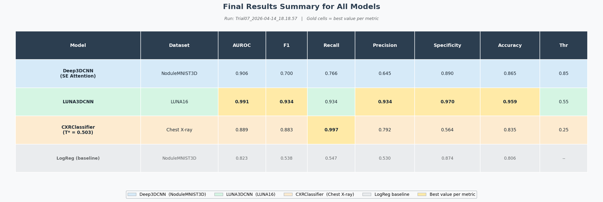

<strong>Trial 7 Confusion Matrices (tuned thresholds):</strong>

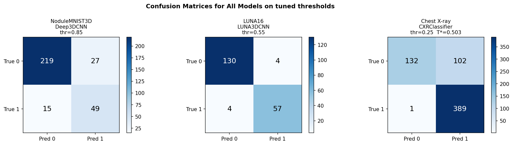

<strong>Trial 7 Deep3DCNN Training Curves (Phase 2, NoduleMNIST3D):</strong>

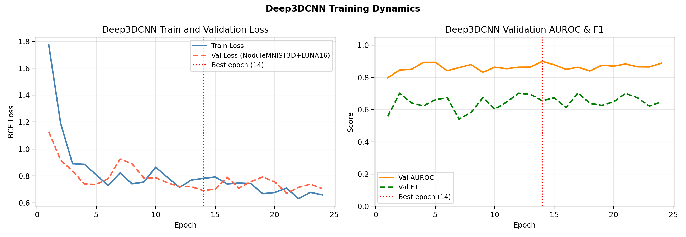

### Trial 7 results: LUNA3DCNN

Training ran 56 epochs total. Best val AUROC: 0.988 at epoch 46; early stopping triggered at epoch 56. Threshold tuned to 0.55 on LUNA16 val set.

#### LUNA16 test set (thr = 0.55)

| Metric | Value |
|---|---|
| AUROC | **0.991** |
| F1 | **0.934** |
| Recall | **0.934** |
| Precision | **0.934** |
| Specificity | **0.970** |
| Accuracy | **0.959** |
| Threshold | 0.55 |

Confusion matrix: TN=130  FP=4  FN=4  TP=57

<strong>Trial 7 LUNA3DCNN Training Curves:</strong>

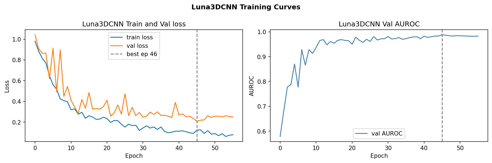

### Trial 7 results: CXRClassifier

Training ran 30 epochs. Best val AUROC: 0.999 at epoch 21. Threshold tuned to 0.25 on calibrated val logits.

| Metric | Value |
|---|---|
| AUROC | 0.889 |
| F1 | 0.883 |
| Recall | **0.997** |
| Precision | 0.792 |
| Specificity | 0.564 |
| Accuracy | 0.835 |
| Threshold (calibrated) | 0.25 |

Confusion matrix: TN=132  FP=102  FN=1  TP=389

#### Comparing Trial 7 vs Trial 6 CXRClassifier

| Metric | Trial 6 (thr=0.40) | Trial 7 (thr=0.25) | Delta |
|---|---|---|---|
| AUROC | 0.886 | **0.889** | **+0.003** |
| F1 | **0.887** | 0.883 | -0.004 |
| Recall | 0.995 | **0.997** | **+0.002** |
| Precision | **0.800** | 0.792 | -0.008 |
| Specificity | **0.585** | 0.564 | -0.021 |
| Accuracy | **0.841** | 0.835 | -0.006 |

<strong>Trial 7 CXR Training Curves:</strong>

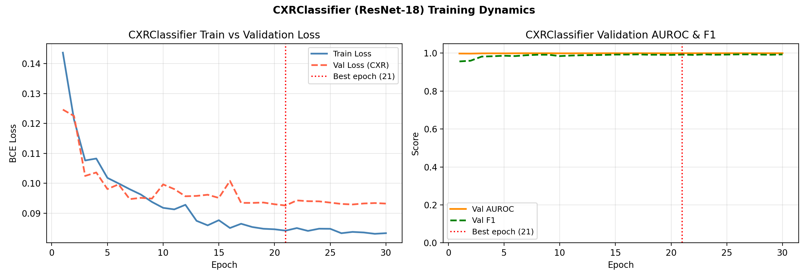

### Interpretation

#### Deep3DCNN: AUROC marginally regressed; F1 and precision improved

AUROC dropped slightly from 0.915 (Trial 6) to 0.906 (Trial 7), a -0.009 change. Recall held exactly at 0.766 in both trials. However, F1 improved from 0.671 to 0.700 (+0.029) and precision from 0.598 to 0.645 (+0.047), with specificity rising from 0.866 to 0.890 (+0.024). The net picture is a marginal AUROC regression alongside a better operating point calibration: the model makes fewer false positive calls per true positive caught.

The high optimal threshold (0.85) mirrors what happened in Trial 4 when LUNA16 was mixed into training. Phase 1 LUNA16 pretraining conditions the backbone to assign high-magnitude logits to clear CT structure (nodule vs. background), and this logit scale partially persists into Phase 2 fine-tuning. When the NoduleMNIST3D fine-tuning adjusts the same weights at a lower LR, the backbone retains higher logit magnitudes overall. Malignant cases score well above 0.85, but benign cases also tend to cluster in the 0.5–0.80 range rather than near 0, pushing the optimal separation threshold upward. The model is not miscalibrated in the ranking sense (AUROC 0.906 demonstrates it still separates the classes well), but its raw probability outputs require a high threshold to extract that separation.

Phase 2 trained for only 24 epochs (best at epoch 14, stopped at 24 by patience=10). The Phase 2 training curves show oscillation in validation AUROC (ranging 0.797 to 0.899), which reflects the difficulty of fine-tuning a backbone already conditioned on a different task with small data (1,158 NoduleMNIST3D training samples). Despite this, val AUROC of 0.899 and test AUROC of 0.906 confirm the transfer is working.

AUROC 0.906 remains well above Trial 5's 0.847 (the best result before removing LUNA16 from joint training), confirming the two-phase approach outperforms the joint training approach. The slight regression vs Trial 6 (NoduleMNIST3D only, no LUNA16 at all) suggests there is a small cost to Phase 1 pretraining but also a benefit, the Phase 2 model generalizes with better precision and specificity despite seeing the same NoduleMNIST3D data. Trial 6 had better raw ranking (AUROC) while Trial 7 has a better operating point at the tuned threshold.

#### LUNA3DCNN: best LUNA16 performance across all trials

AUROC 0.991, F1 0.934, Precision 0.934, Recall 0.934, Specificity 0.970; every metric well above any previous LUNA16 evaluation. The prior best (Trial 5, joint training) achieved AUROC 0.960; the dedicated LUNA3DCNN adds +0.031 in AUROC and substantially improves precision (0.930 → 0.934) while achieving a balanced Recall/Precision tradeoff.

The result confirms the central hypothesis for Trial 7: a purpose-built model for each task, trained exclusively on its own dataset, outperforms any joint or shared architecture. The LUNA16 task (nodule vs. background) is sufficiently different from malignancy classification that a dedicated model with simpler architecture (no SE, lower dropout) achieves near-ceiling performance. Confusion matrix shows only 4 FP and 4 FN out of 195 test samples.

LUNA3DCNN at ~2.0M parameters is roughly half the size of Deep3DCNN (~3.7M) and achieves substantially higher metrics because it is not asked to solve a harder task. Architecture complexity should match task difficulty.

#### CXRClassifier: essentially unchanged, sampling removed with no significant effect

Removing the WeightedRandomSampler and returning to natural distribution had a near-neutral effect: AUROC improved marginally from 0.886 to 0.889 (+0.003), Recall held at near-perfect 0.997 (1 missed cancer case in 390). Specificity moved slightly in the wrong direction: 0.585 → 0.564 (-0.021). The changes are within noise for a 624-sample test set.

The threshold shifted from 0.40 (Trial 6) to 0.25 (Trial 7). Despite returning to the natural 74.3% Cancer training rate, the model still requires a lower-than-expected threshold, suggesting that without the rebalanced sampler pushing decision boundary toward the center, the model is more aggressive in flagging Cancer; it needs a lower threshold to sweep up the recall. This is the opposite tradeoff from Trial 6: the sampler in Trial 6 pushed the model conservative (high T* < 1, high threshold = 0.40); removing it makes the model more liberal (lower threshold = 0.25). Both achieve near-identical recall (0.995 vs 0.997) at similar specificity (~0.57).

The two trials are effectively at the same operating point as the sampler change was a wash for this model and dataset size. The CXRClassifier appears to have reached a performance ceiling on this dataset, with Recall near 1.0 and Specificity constrained to the 0.55–0.60 range regardless of training strategy.

#### LogReg baseline gap

LogReg (NoduleMNIST3D flat voxels) held at AUROC 0.823 across trials. The final Deep3DCNN gap is +0.083 (0.906 vs 0.823), confirming the 3D CNN extracts genuinely useful volumetric features that flat logistic regression cannot recover from flattened voxels.
