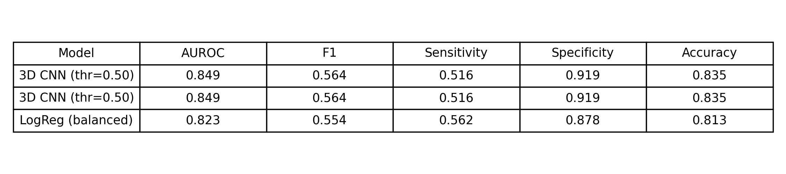
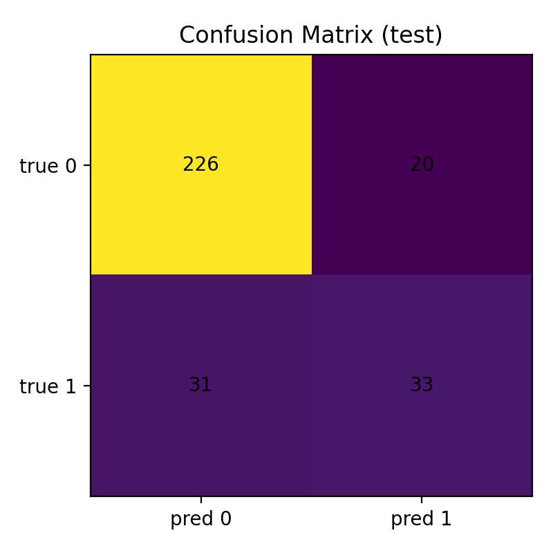
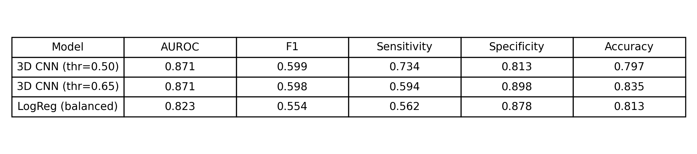
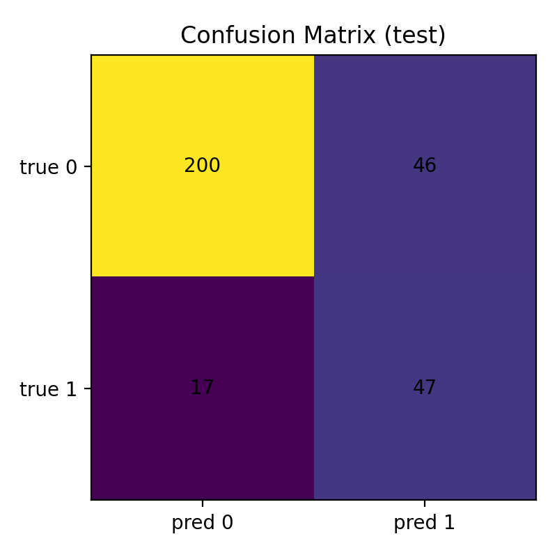

# Implementation Notes
This is where I'll log my notes about what I tried, what worked, what didn't work, and what I plan to try in subsequent implementation trials in hopes to keep improving model accuracy. 

## Table of Contents

**[Trial 0: Initial Model Implementation](trial-1:-initial-model-implementation)**

**[Trial 1: Simple Performance Upgrades](trial-2:-simple-performance-upgrades)**

---

## Trial 0: Initial Model Implementation
- Started with a small 3D CNN trained on NoduleMNIST3D
- Evaluated with a fixed decision threshold of **0.50**
- On the test set, that baseline reached **AUROC 0.849**, **F1 0.564**, and **Accuracy 0.835**.

<strong>Trial 1 Model Results:</strong>

<strong>Trial 1 Confusion Matrix:</strong>

<strong>Trial 1 Training Loss:</strong>

---
## Trial 1: Simple Performance Upgrades

This trial focused on a few “low effort, high impact” upgrades while keeping the project lightweight:

* **Trained longer with learning rate (LR) scheduling**: 
  * Did this so that training can keep improving without manually tuning LR every time
  * The run logs show training continuing out to later epochs while tracking LR as it decays
* **Validation-based threshold tuning**:
  * instead of assuming 0.50, On the validation sweep, the best F1 occurred at **threshold = 0.65**. 
* **Re-evaluated test performance at both thresholds**:
  * With **thr = 0.50**, test metrics improved to **AUROC 0.871**, **F1 0.599**, **Accuracy 0.797**, and sensitivity increased a lot
  * With the **tuned threshold (thr = 0.65)**, test **Accuracy returned to 0.835** while keeping AUROC at **0.871** and shifting the sensitivity/specificity tradeoff. 

<strong>Trial 2 Model Results:</strong>

<strong>Trial 2 Confusion Matrix:</strong>

<strong>Trial 2 Training Loss:</strong>

Trial 2 did improve the model, but the improvement showed up more in how well it ranks positives above negatives than accuracy number.

AUROC improved from 0.849 to 0.871, which means the CNN is separating benign vs malignant volumes more consistently overall (better ordering of scores).

At the default threshold (0.50), Trial 2 shifted the model toward catching more malignant cases:

Sensitivity jumped from 0.516 to 0.734 (31 → 17 false negatives)

But that came with more false alarms: Specificity dropped from 0.919 to 0.813 (20 → 46 false positives)

So accuracy fell from 0.835 to 0.797, because the test set has more benign cases and false positives are “expensive” in accuracy.

With the tuned threshold (0.65), the tradeoff moves back toward the Trial 1 balance:

Accuracy returns to 0.835 and specificity improves to 0.898, but sensitivity drops to 0.594 (still better than Trial 1’s 0.516).

AUROC stays 0.871, because AUROC doesn’t depend on the threshold, only on ranking.

Logistic regression stayed basically the same (AUROC 0.823, F1 0.554, accuracy 0.813), so the gains in Trial 2 are coming from the CNN changes, not noise in the pipeline.

---

## What to try next (Trial 03)

A couple options that tend to move the needle without blowing up scope:

* **Better augmentation for 3D volumes** (small rotations, mild zoom/crop, random intensity jitter), then re-run threshold tuning and see if sensitivity can climb without sacrificing specificity.
* **Swap the backbone** to a small 3D ResNet-style model or add residual blocks (often improves representation quality more than just adding one more conv layer), then keep the same evaluation and logging pipeline.
